# HC3 AI Generated Text Detection

方向一：AI 生成文本的特征挖掘与检测

本项目基于 HC3 (Human ChatGPT Comparison Corpus) 数据集，构建可解释的
人类文本 vs ChatGPT 文本二分类系统。从浅层统计特征到深层语义嵌入，系统
地挖掘 AI 生成文本的可量化信号，并通过 SHAP 归因分析提供模型可解释性。

## 1. Dataset

HC3 数据集来自 Hugging Face (`Hello-SimpleAI/HC3`)，包含同一问题下的人类
回答和 ChatGPT 回答。

| 统计项 | 数值 |
|---|---:|
| 原始问题数 | 24,322 |
| 展平后文本行数 | 85,431 |
| 人类回答 | 58,546 (68.5%) |
| ChatGPT 回答 | 26,885 (31.5%) |

数据覆盖 5 个领域：reddit_eli5 (67,996)、finance (8,436)、open_qa (4,733)、
medicine (2,582)、wiki_csai (1,684)。

---

## 2. Feature Engineering (90 Features)

本项目共提取 90 个特征，分为 9 组。以下对每个特征给出定义与公式。

### 2.1 Basic Counts (4 features)

基础计数特征，度量文本的长度规模。

| 特征 | 定义 |
|---|---|
| `char_count` | 文本的总字符数（含空格和标点），即 `len(text)`。最直接的长度度量。 |
| `word_count` | 文本中的单词数。使用正则 `[A-Za-z]+(?:'[A-Za-z]+)?` 匹配英文单词。 |
| `sentence_count` | 句子数量。通过句末标点 `.!?` 后跟空白来切分句子。 |
| `paragraph_count` | 段落数量。通过连续换行符 `\n\s*\n` 分割段落。 |

### 2.2 Averages (3 features)

均值特征，描述文本的"粒度"和节奏。

| 特征 | 公式 | 含义 |
|---|---|---|
| `avg_word_len` | $\frac{\sum_{i=1}^{N} \lvert w_i \rvert}{N}$，其中 $\lvert w_i \rvert$ 为第 $i$ 个词的字母数 | 平均词长。较长的平均词长通常意味着使用了更专业或更正式的词汇。 |
| `avg_sentence_len` | $\frac{W}{S}$，其中 $W$ 为词数，$S$ 为句数 | 平均句长（词/句）。ChatGPT 倾向于生成更长、更完整的句子。 |
| `avg_paragraph_len` | $\frac{W}{P}$，其中 $W$ 为词数，$P$ 为段落数 | 平均段落长度（词/段）。反映文本的组织粒度。 |

### 2.3 Variability (4 features)

变异性特征，度量句子和词语长度的波动程度。

| 特征 | 公式 | 含义 |
|---|---|---|
| `word_len_std` | $\sigma(\lvert w_1 \rvert, \lvert w_2 \rvert, \dots)$ | 词长标准差。人类写作中词长变化更大，AI 倾向使用长度均匀的词。 |
| `sentence_len_std` | $\sigma(s_1, s_2, \dots)$，其中 $s_i$ 为第 $i$ 个句子的词数 | 句长标准差。值越大表示句子长短交错越明显。 |
| `max_sentence_len` | $\max(s_1, s_2, \dots)$ | 最长句子的词数。 |
| `min_sentence_len` | $\min(s_1, s_2, \dots)$ | 最短句子的词数。 |

### 2.4 Lexical Richness (6 features)

词汇丰富度特征，衡量用词的多样性和重复程度。

| 特征 | 公式 | 含义 |
|---|---|---|
| `type_token_ratio` | $\mathrm{TTR} = \frac{V}{N}$，其中 $V$ 为不同词数（types），$N$ 为总词数（tokens） | 词型-词例比。值越高说明词汇越丰富。人类文本通常有更高的 TTR。 |
| `hapax_legomena_ratio` | $\frac{V_1}{N}$，其中 $V_1$ 为只出现一次的词数 | Hapax 比率。只出现一次的词占总词数的比例，反映用词的独特性。 |
| `long_word_ratio` | $\frac{\lvert \{w : \lvert w \rvert \geq 6\} \rvert}{N}$ | 长词比例（6 个字母及以上）。 |
| `yules_k` | $K = 10^4 \cdot \frac{\sum_{i=1}^{m} i^2 V_i - N}{N^2}$，其中 $V_i$ 为出现 $i$ 次的词的数量 | Yule's K 常数。值越大表示词汇重复程度越高（多样性越低）。该指标对文本长度较不敏感。 |
| `simpsons_diversity` | $D = 1 - \frac{\sum_{i} n_i(n_i - 1)}{N(N-1)}$，其中 $n_i$ 为第 $i$ 个词型的频次 | Simpson 多样性指数。值越接近 1 表示多样性越高。 |
| `brunet_w` | $W = N^{V^{-0.172}}$ | Brunet's W。值越大表示词汇越贫乏。相比 TTR，该指标对文本长度更稳健。 |

### 2.5 Punctuation & Formatting (10 features)

标点与格式特征，捕捉书写习惯和排版风格。

| 特征 | 公式 | 含义 |
|---|---|---|
| `stopword_ratio` | $N_{\mathrm{stop}} / N$ | 停用词比例。停用词集包含 the, is, at 等 30 个高频功能词。 |
| `punct_ratio` | $N_{\mathrm{punct}} / C$ | 标点符号占总字符的比例。 |
| `comma_ratio` | $N_{\mathrm{comma}} / C$ | 逗号密度。ChatGPT 倾向使用更多逗号来连接复杂句。 |
| `semicolon_ratio` | $N_{\mathrm{semicolon}} / C$ | 分号密度。 |
| `question_ratio` | $N_{?} / C$ | 问号密度。人类回答中更常出现反问。 |
| `exclamation_ratio` | $N_{!} / C$ | 感叹号密度。人类文本中情感表达更丰富。 |
| `colon_ratio` | $N_{\mathrm{colon}} / C$ | 冒号密度。ChatGPT 常用冒号引出列表或解释。 |
| `parenthesis_ratio` | $N_{\mathrm{paren}} / C$ | 括号密度。ChatGPT 更频繁使用括号补充说明。 |
| `uppercase_ratio` | $N_{\mathrm{upper}} / N_{\mathrm{alpha}}$ | 大写字母占比。 |
| `digit_ratio` | $N_{\mathrm{digit}} / C$ | 数字字符占比。 |

### 2.6 Structure (4 features)

结构特征，衡量文本的组织方式和模板化程度。

| 特征 | 公式 | 含义 |
|---|---|---|
| `transition_per_100w` | $\frac{N_{\mathrm{trans}} \times 100}{N}$ | 每 100 词中的过渡短语数量。过渡词包括 "however", "moreover", "in conclusion" 等 23 个短语。ChatGPT 显著更多使用过渡词。 |
| `bullet_point_count` | 匹配 `^\s*[-*]\s` 的行数 | 列表项（bullet point）数量。AI 文本更倾向于使用列表来组织回答。 |
| `number_count` | 匹配 `\d+` 的数量 | 文本中数字的出现次数。 |
| `repeated_3gram_ratio` | $\frac{\lvert \{g : f(g) > 1\} \rvert}{\lvert G \rvert}$，其中 $G$ 为所有 3-gram 集合 | 重复三元组比例。出现超过 1 次的 3-gram 占总 3-gram 的比例。AI 文本更容易产生重复的短语模式。 |

### 2.7 Readability (7 features)

可读性特征，使用经典的文本可读性公式。这些指标从不同角度评估文本的阅读难度。

| 特征 | 公式 | 含义 |
|---|---|---|
| `flesch_reading_ease` | $206.835 - 1.015 \cdot \frac{N}{S} - 84.6 \cdot \frac{Y}{N}$，其中 $S$ 为句数，$Y$ 为音节数 | Flesch 阅读易度。分数越高越容易阅读（0-100）。人类文本通常更易读。 |
| `flesch_kincaid_grade` | $0.39 \cdot \frac{N}{S} + 11.8 \cdot \frac{Y}{N} - 15.59$ | Flesch-Kincaid 年级水平。对应美国学校年级，值越高要求的阅读水平越高。ChatGPT 文本的年级水平更高。 |
| `gunning_fog` | $0.4 \cdot \left(\frac{N}{S} + 100 \cdot \frac{C}{N}\right)$，其中 $C$ 为复杂词数（3+ 音节） | Gunning Fog 指数。估计理解文本所需的正规教育年限。 |
| `smog_index` | $3 + \sqrt{\frac{C \times 30}{S}}$ | SMOG 指数。基于多音节词的比例，估计理解文本所需的教育年限。 |
| `coleman_liau_index` | $0.0588L - 0.296S' - 15.8$，其中 $L$ 为每 100 词的平均字母数，$S'$ 为每 100 词的平均句子数 | Coleman-Liau 指数。仅依赖字符和句子计数，不需要音节分析。 |
| `automated_readability_index` | $4.71 \cdot \frac{C}{N} + 0.5 \cdot \frac{N}{S} - 21.43$，其中 $C$ 为字符数 | ARI 自动可读性指数。对应理解文本所需的年级水平。在本实验中 LR 系数最大，是区分人类与 AI 文本最强的单一可读性特征。 |
| `dale_chall_score` | 基于 Dale-Chall 3000 常用词表，统计"困难词"比例并加权计算 | Dale-Chall 可读性分数。使用常用词表判定困难词，分数越高文本越难。 |

### 2.8 Semantic Embedding (50 features)

语义嵌入特征，使用预训练语言模型捕捉深层语义信息。

| 特征 | 方法 | 含义 |
|---|---|---|
| `emb_pc0` ~ `emb_pc49` | 使用 `all-MiniLM-L6-v2` (sentence-transformers) 将文本编码为 384 维向量，再通过 PCA 降维到 50 维 | 语义主成分。前 50 个主成分解释了约 45.2% 的总方差。这些特征捕捉了文本在语义空间中的位置，人类和 AI 文本在语义空间中有可分离的聚类趋势（见 PCA/t-SNE 图）。 |

### 2.9 Perplexity (2 features)

困惑度特征，使用 GPT-2 语言模型度量文本的"意外程度"。

| 特征 | 公式 | 含义 |
|---|---|---|
| `gpt2_perplexity` | $\mathrm{PPL} = \exp\left(-\frac{1}{T}\sum_{t=1}^{T} \log P(x_t \mid x_{<t})\right)$ | GPT-2 困惑度。衡量 GPT-2 模型对文本的"惊讶程度"。**AI 生成文本的困惑度显著低于人类文本**，因为 AI 输出更符合语言模型的概率分布。该特征是消融实验中单组最强的特征（仅 2 个特征即达 AUC 0.9912）。 |
| `log_perplexity` | $\log(1 + \mathrm{PPL})$ | 对数困惑度。对原始困惑度取 log 变换以压缩极端值，使分布更接近正态。 |

---

## 3. Evaluation Metrics

### 3.1 ROC AUC (Area Under the Receiver Operating Characteristic Curve)

$$\mathrm{AUC} = \int_0^1 \mathrm{TPR}(t) \, d(\mathrm{FPR}(t))$$

ROC 曲线以假阳性率（FPR）为横轴、真阳性率（TPR）为纵轴，AUC 为其下面积。
AUC = 1.0 表示完美分类，AUC = 0.5 表示随机猜测。AUC 对类别不平衡具有鲁棒性，
因此是本项目（human 68.5% vs chatgpt 31.5%）的首选指标。

### 3.2 Accuracy

$$\mathrm{Accuracy} = \frac{TP + TN}{TP + TN + FP + FN}$$

准确率，所有预测正确的样本占总样本的比例。直观但在类别不平衡时可能产生误导。

### 3.3 Precision

$$\mathrm{Precision} = \frac{TP}{TP + FP}$$

精确率，预测为正类的样本中有多少确实为正类。高 Precision 意味着较少的误报。

### 3.4 Recall

$$\mathrm{Recall} = \frac{TP}{TP + FN}$$

召回率，实际正类中有多少被成功识别。高 Recall 意味着较少的漏检。

### 3.5 F1 Score

$$F_1 = 2 \cdot \frac{\mathrm{Precision} \cdot \mathrm{Recall}}{\mathrm{Precision} + \mathrm{Recall}}$$

F1 是 Precision 和 Recall 的调和平均数，在两者之间取得平衡。当类别不平衡
时，F1 比 Accuracy 更具参考价值。

---

## 4. Baseline Result (LR + TF-IDF, 17 features)

第一阶段基线使用 17 个浅层统计特征加 TF-IDF 文本特征，训练 Logistic Regression。

Full HC3 (85,431 rows):

| Metric | Value |
|---|---:|
| ROC AUC | 0.9955 |
| Accuracy | 0.97 |
| Human P / R / F1 | 0.99 / 0.97 / 0.98 |
| ChatGPT P / R / F1 | 0.94 / 0.98 / 0.96 |

Balanced 30,000-row pilot:

| Metric | Value |
|---|---:|
| ROC AUC | 0.9859 |
| Accuracy | 0.95 |
| Human F1 | 0.95 |
| ChatGPT F1 | 0.95 |

---

## 5. Extended Experiment Results (90 features)

第二阶段使用全部 90 个扩展特征（无 TF-IDF），对比三个模型。数据划分为 80%
训练集 / 20% 测试集，按标签分层抽样。

### 5.1 Model Comparison

| Model | ROC AUC | Accuracy | Human P / R / F1 | ChatGPT P / R / F1 |
|---|---:|---:|---|---|
| Logistic Regression | 0.9984 | 0.9898 | 1.00 / 0.99 / 0.99 | 0.98 / 0.99 / 0.98 |
| **XGBoost** | **0.9999** | **0.9964** | **1.00 / 1.00 / 1.00** | **0.99 / 1.00 / 0.99** |
| Random Forest | 0.9996 | 0.9927 | 1.00 / 0.99 / 0.99 | 0.99 / 0.99 / 0.99 |

XGBoost 在所有指标上均为最优，仅 61 个样本被错分（35 个 human 被误判为 chatgpt，
26 个 chatgpt 被误判为 human）。

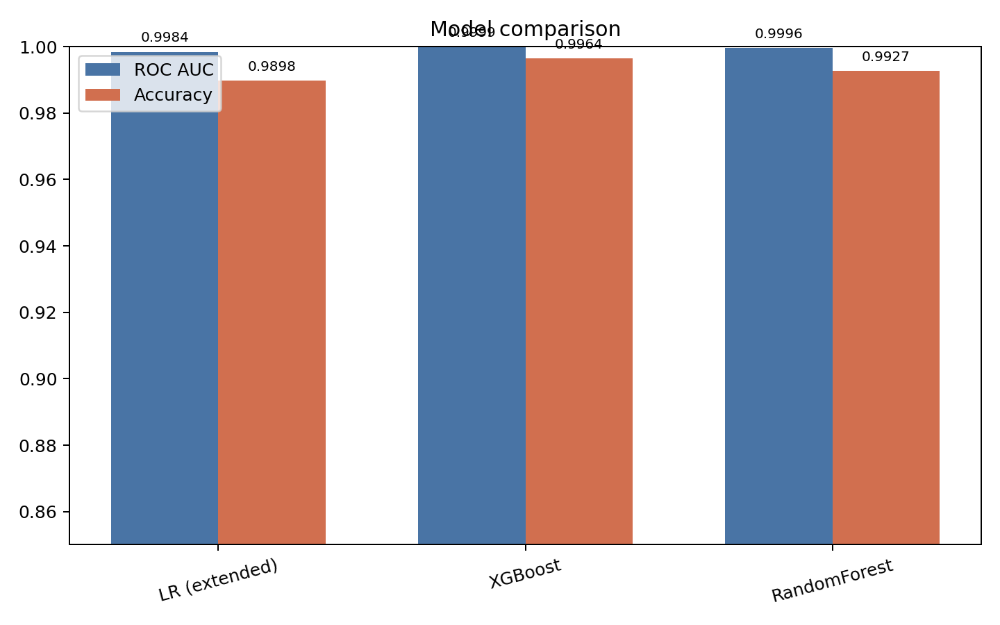

### 5.2 XGBoost Confusion Matrix

在 17,087 个测试样本中，XGBoost 的错误率仅为 0.36%。

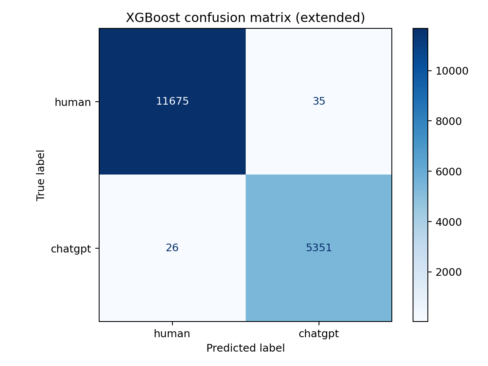

### 5.3 Improvement over Baseline

| 对比 | ROC AUC | Accuracy |
|---|---:|---:|
| Baseline LR (17 feat + TF-IDF) | 0.9955 | 0.97 |
| Extended LR (90 feat, no TF-IDF) | 0.9984 (+0.0029) | 0.9898 (+0.02) |
| Extended XGBoost (90 feat) | 0.9999 (+0.0044) | 0.9964 (+0.03) |

扩展特征在不使用 TF-IDF 的情况下已超越基线，说明深层统计和语义特征比词袋
模型更有效。

---

## 6. Feature Ablation Study

对每组特征单独训练 XGBoost，评估各组的独立判别能力。

| Feature Group | # Features | AUC | Interpretation |
|---|---:|---:|---|
| **perplexity** | 2 | **0.9912** | 最强单组。GPT-2 困惑度直接度量文本与语言模型的契合度，AI 文本的困惑度远低于人类文本。 |
| readability | 7 | 0.9741 | 可读性公式综合了句长、词长、音节等信息，能有效捕捉 AI 文本更高的阅读等级。 |
| lexical_richness | 6 | 0.9367 | 词汇多样性指标。AI 文本用词重复度更高，TTR 和 Simpson 多样性更低。 |
| punctuation | 10 | 0.9207 | 标点习惯差异。AI 更多使用逗号、冒号、括号；人类更多使用问号、感叹号。 |
| basic_counts | 4 | 0.9204 | 长度本身就是信号：ChatGPT 回答平均更长。 |
| averages | 3 | 0.9021 | 平均句长和段落长度反映 AI 生成的均匀节奏。 |
| variability | 4 | 0.8987 | 句长和词长的波动度。人类写作的句长变化更不规律。 |
| embedding_pca | 50 | 0.8972 | 语义嵌入在独立使用时表现中等，但与其他特征组合后互补性强。 |
| structure | 4 | 0.8965 | 过渡词和重复模式。ChatGPT 大量使用 "however", "moreover" 等过渡短语。 |

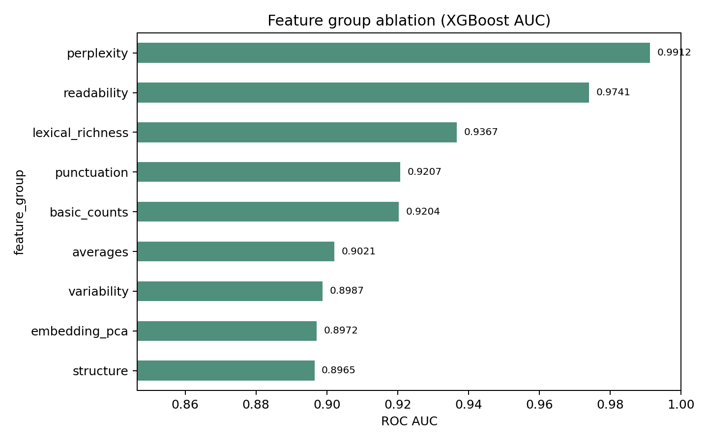

---

## 7. Figures & Analysis

### 7.1 Class Distribution

数据集类别分布不平衡：human 占 68.5%，chatgpt 占 31.5%。模型训练时使用
`class_weight="balanced"` 进行补偿。

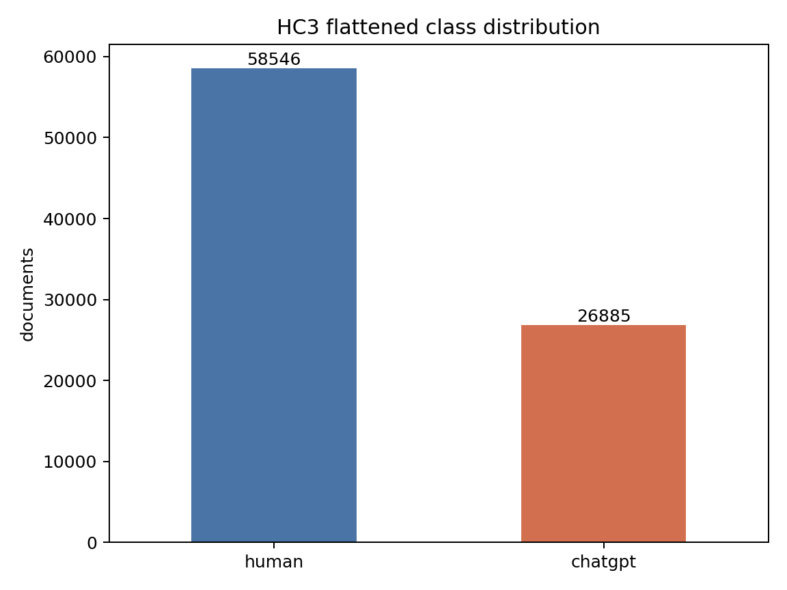

### 7.2 Feature Correlation Heatmap

90 个特征的皮尔逊相关矩阵。可以观察到：

- **高正相关**：`char_count`、`word_count`、`sentence_count` 互相强正相关（长文本各方面计数都高）。可读性指标组内部（`gunning_fog`、`smog_index`、`coleman_liau_index` 等）也强正相关。
- **强负相关**：`flesch_reading_ease` 与 `flesch_kincaid_grade` 强负相关（越容易读的文本年级水平越低）。
- **弱相关/独立**：`gpt2_perplexity` 与大多数浅层特征的相关性较弱，说明困惑度提供了互补的判别信息。

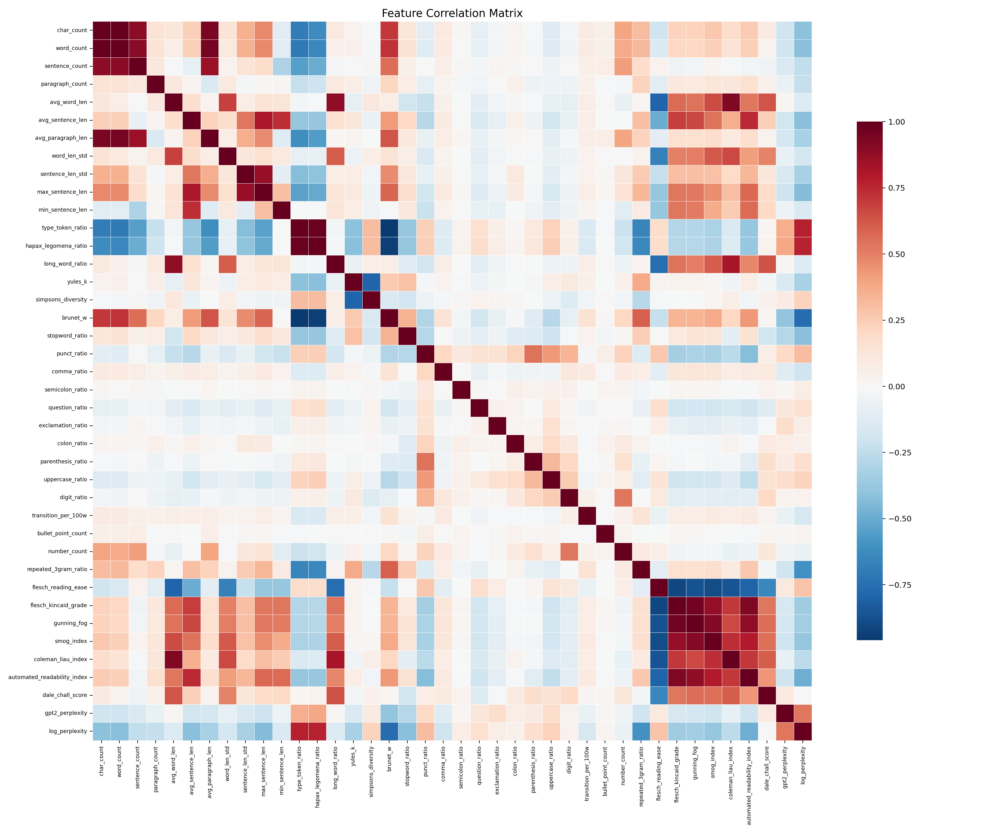

### 7.3 PCA Visualization

对标准化后的 90 维特征做 PCA 降维到 2 维。PC1 解释 11.8% 方差，PC2 解释 6.6%。
两类文本在低维空间中有清晰的分离趋势，但存在重叠区域。

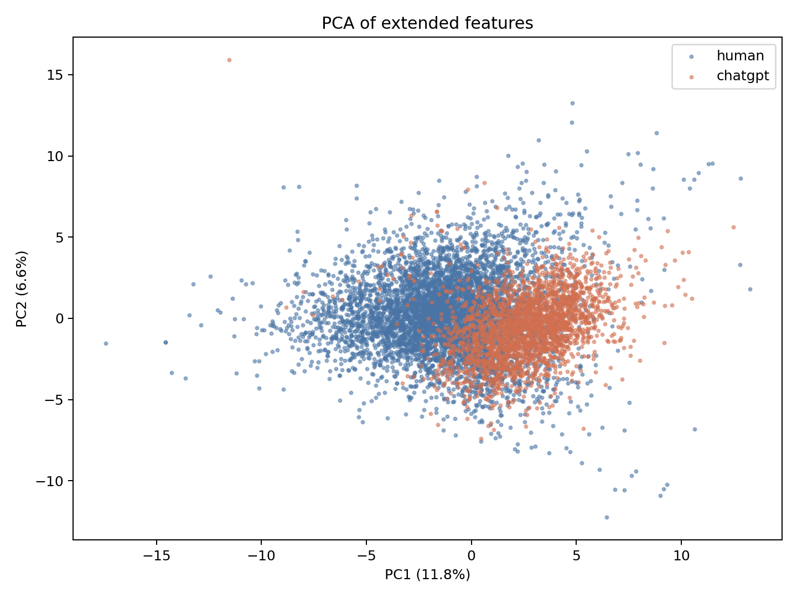

### 7.4 t-SNE Visualization

t-SNE 非线性降维（perplexity=30，5000 采样点）。相比 PCA，t-SNE 能更好地
展现局部聚类结构。两类文本形成了可区分的集群，但边界处存在交错。

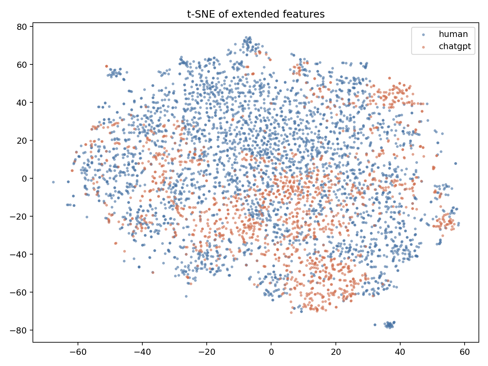

### 7.5 SHAP Summary (XGBoost)

SHAP（SHapley Additive exPlanations）基于博弈论的 Shapley 值，量化每个
特征对单个预测的贡献。图中每个点代表一个样本，横轴为 SHAP 值（正值推向
ChatGPT 类），颜色表示特征原始值的高低。

关键发现：
- **`gpt2_perplexity`**：低困惑度（蓝色点）强烈推向 ChatGPT 预测，是最重要的特征。
- **`automated_readability_index`**：高 ARI（红色点）推向 ChatGPT，说明 AI 文本的可读性等级更高。
- **`paragraph_count`**：ChatGPT 回答包含更多段落。
- **`parenthesis_ratio`**：ChatGPT 更频繁使用括号。

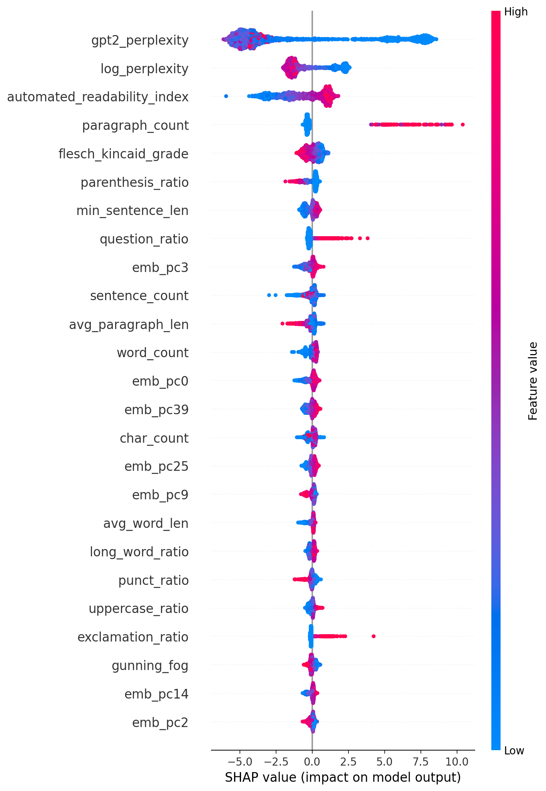

### 7.6 LR Top-20 Feature Coefficients

Logistic Regression 标准化系数的 Top-20。正系数指向 ChatGPT，负系数指向人类。

- **指向 ChatGPT**（正系数）：`automated_readability_index`、`word_count`、`hapax_legomena_ratio`、`gpt2_perplexity`（注：低困惑度在标准化后系数为正）。
- **指向 Human**（负系数）：`flesch_kincaid_grade`、`avg_paragraph_len`、`flesch_reading_ease`、`log_perplexity`、`coleman_liau_index`。

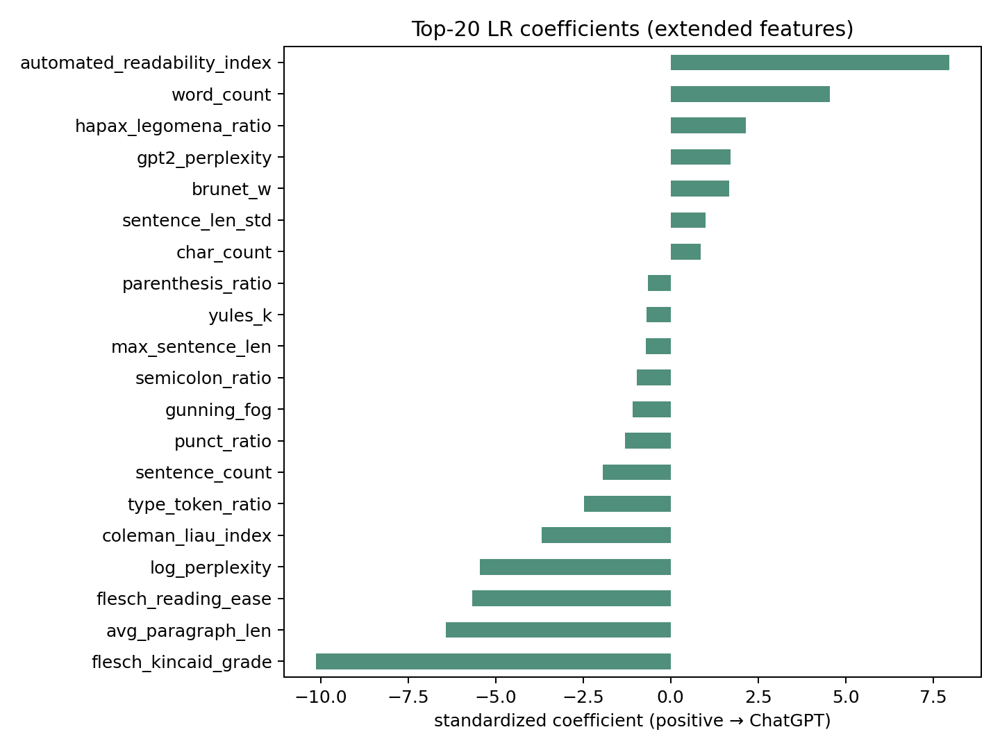

### 7.7 Domain Feature Comparison

按 5 个数据领域分别展示 6 个关键特征在人类/ChatGPT 之间的分布差异。

关键发现：
- **`type_token_ratio`**：在所有领域中，人类文本的 TTR 都高于 ChatGPT。
- **`transition_per_100w`**：ChatGPT 在所有领域中都使用更多过渡词，但在 finance 和 medicine 领域差异最明显。
- **`avg_sentence_len`**：ChatGPT 的平均句长在大多数领域更高，但 reddit_eli5 差异最小（因为 Reddit 的人类回答风格也较长）。

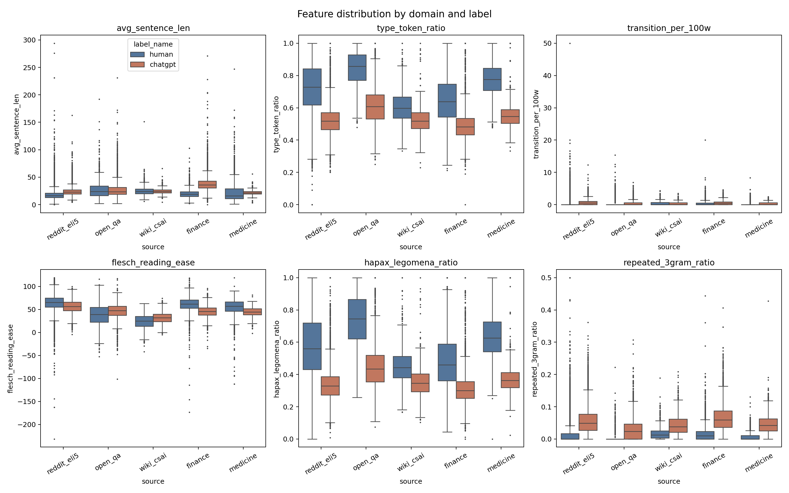

### 7.8 Baseline Figures

以下图表来自第一阶段基线实验（17 特征 + TF-IDF）。

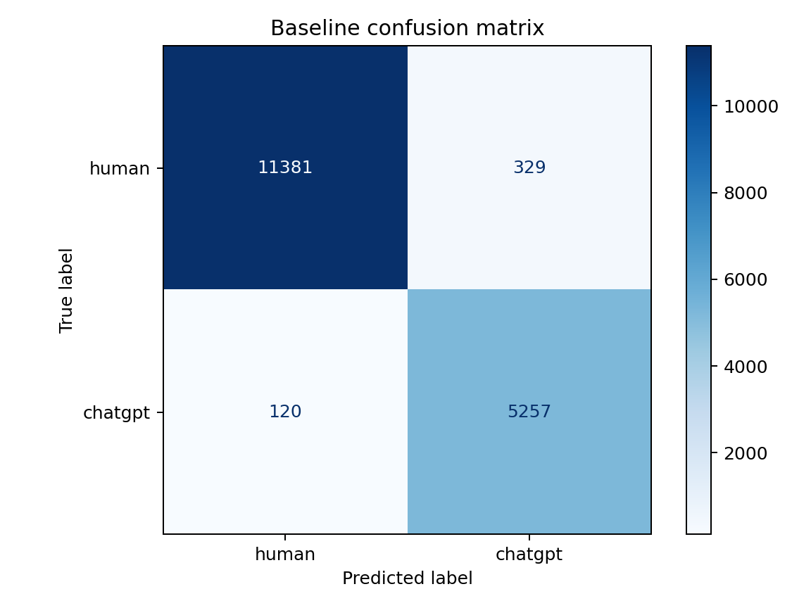

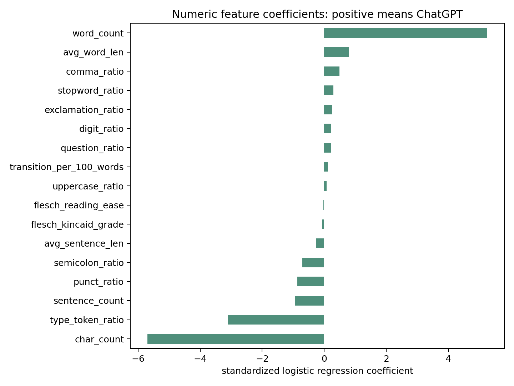

---

## 8. Advanced Detection Methods

除了手工特征 + 传统分类器，本项目还实现了三种最新的 AI 文本检测方法，
覆盖三个不同的技术范式。

### 8.1 Method Principles

下图展示了四种方法的核心原理：

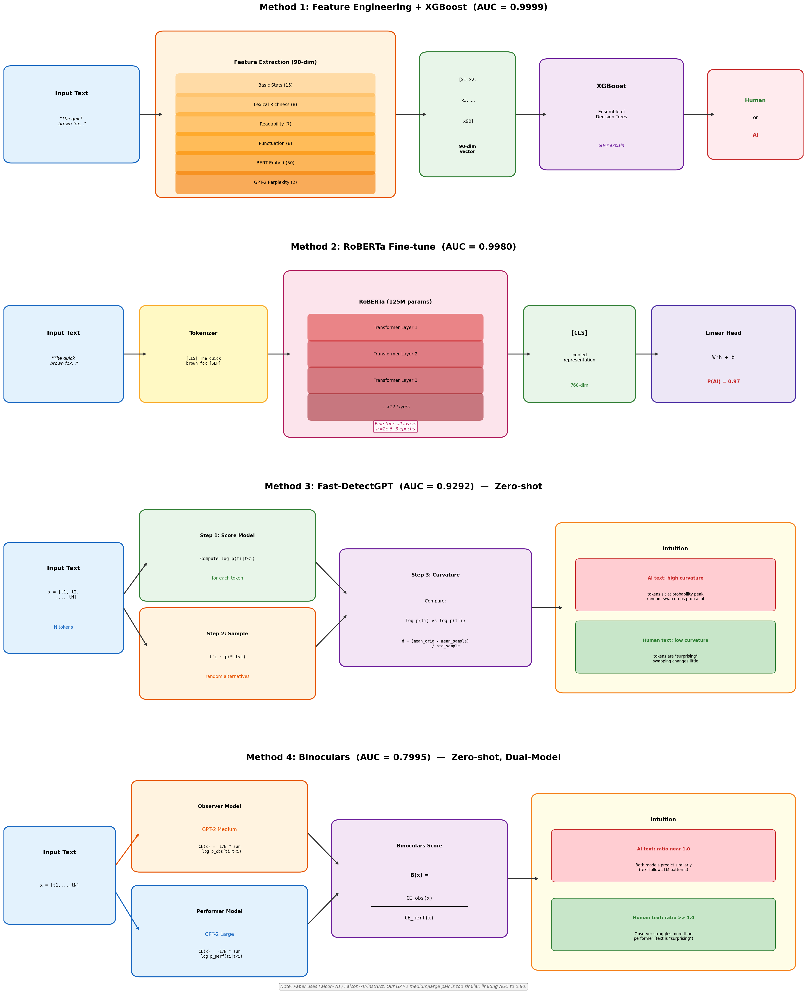

### 8.2 Method Overview

| 方法 | 范式 | 是否需要训练 | 论文 |
|---|---|---|---|
| XGBoost (90 features) | 手工特征 + 传统 ML | 有监督 | — |
| RoBERTa fine-tune | 预训练模型微调 | 有监督 | Liu et al., 2019 |
| Fast-DetectGPT | 零样本概率曲率 | 无需训练 | Bao et al., ICLR 2024 |
| Binoculars | 零样本双模型对比 | 无需训练 | Hans et al., ICML 2024 |

### 8.3 RoBERTa Fine-tune

在 HC3 上 fine-tune `roberta-base` (125M params) 做二分类。模型直接从
原始文本学习判别特征，不需要手工设计特征。

**架构**：RoBERTa encoder → [CLS] embedding (768d) → Dropout(0.1) → Linear(768, 2) → softmax

**训练配置**：3 epochs, batch size 32, lr 2e-5 (AdamW), FP16, A100 GPU

### 8.4 Fast-DetectGPT

Fast-DetectGPT 的核心观察：**AI 生成文本处于语言模型概率曲面的局部极大值附近**。

对每个位置 $t$，从模型的条件分布中采样一个替代 token $\hat{x}_t$，然后比较
原始 token 与采样 token 的对数概率差异：

$$\tilde{d}(x) = \frac{\frac{1}{T}\sum_t [\log p_\theta(x_t \mid x_{<t}) - \log p_\theta(\hat{x}_t \mid x_{<t})]}{\sigma}$$

如果原始 token 的概率始终远高于随机采样的 token（分数大），说明原文处于
概率峰值，更可能是 AI 生成的。

**评分模型**：GPT-2 medium

### 8.5 Binoculars

Binoculars 使用两个不同的语言模型计算同一文本的交叉熵比值：

$$B(x) = \frac{H_{M_1}(x)}{H_{M_2}(x)}$$

核心假设：AI 生成的文本在任何相似 LLM 下都表现"正常"（低交叉熵），
因此两个模型的交叉熵比值接近 1；而人类文本在不同模型间的交叉熵差异更大。

**模型对**：GPT-2 medium (observer) / GPT-2 large (performer)

**注**：论文原文使用 7B 级别模型对（如 Falcon-7b / Falcon-7b-instruct），
效果更好。本实验使用 GPT-2 medium/large 作为轻量级复现，两个模型过于
相似导致比值信号较弱。单模型 CE 的 AUC (0.9891) 远高于比值 (0.7995)。

### 8.6 All Methods Comparison

| Method | Type | Training | ROC AUC | Accuracy | Short-text AUC (<100w) |
|---|---|---|---:|---:|---:|
| **XGBoost (90 feat)** | 手工特征 | 有监督 | **0.9999** | **0.9964** | **0.9995** |
| LR (90 feat) | 手工特征 | 有监督 | 0.9984 | 0.9898 | — |
| RoBERTa fine-tune | 深度学习 | 有监督 | 0.9980 | 0.9748 | 0.9965 |
| Baseline LR (17 feat + TF-IDF) | 手工特征 | 有监督 | 0.9955 | 0.97 | — |
| Fast-DetectGPT | 零样本 | 无 | 0.9292 | 0.8954 | 0.9048 |
| Binoculars (GPT-2 pair) | 零样本 | 无 | 0.7995 | 0.8141 | 0.7855 |
| Single-model CE (GPT-2 medium) | 统计 | 无 | 0.9891 | — | — |
| **Single-model CE (Mistral-7B-Instruct)** | 统计 | 无 | **0.9933** | 0.9848 | — |
| Binoculars (Mistral-7B base/instruct) | 零样本 | 无 | 0.5666 | — | — |
| Binoculars (Llama-3.1-8B base/instruct) | 零样本 | 无 | 0.5762 | — | — |
| Binoculars (Qwen2.5-7B base/instruct) | 零样本 | 无 | 0.5134 | — | — |

### 8.7 Analysis

**有监督方法大幅领先零样本方法**。XGBoost (AUC 0.9999) 和 RoBERTa (0.9980)
在 HC3 数据集上都接近完美分类，而零样本方法 Fast-DetectGPT (0.9292) 和
Binoculars (0.7995) 明显落后。这符合预期：有监督方法在分布内数据上总是更强。

**零样本方法的价值在于泛化**。它们不依赖训练数据，理论上对未见过的 LLM
（如 GPT-4、Claude）仍然有效，而有监督模型可能需要重新训练。

**GPT-2 perplexity 仍是最有信息量的单一信号**。单模型 CE AUC 达到 0.9891，
与 90 个手工特征的 LR (0.9984) 差距不大，说明 AI 文本的概率分布特征是
最本质的判别信号。

**Binoculars 在 GPT-2 级别模型上效果不佳**。GPT-2 medium 和 large 架构
太相似，交叉熵比值缺乏区分度。然而，**升级到 7B 模型对（Llama-3.1、Qwen2.5、Mistral）后
Binoculars 比值反而更差**（AUC 0.51-0.58，接近随机），因为 base/instruct 的 CE 方向一致，
比值抹掉了有用信号。**真正有效的是单模型困惑度**：Mistral-7B-Instruct 单模型 CE 达到
AUC 0.9933，超越所有零样本方法，仅次于 XGBoost (0.9999)。

**短文本是零样本方法的弱点**。Fast-DetectGPT 的短文本 AUC 降至 0.9048，
而 XGBoost (0.9995) 和 RoBERTa (0.9965) 几乎不受影响。

### 8.8 Advanced Method Figures

#### Fast-DetectGPT Score Distribution


#### Binoculars Score Distribution

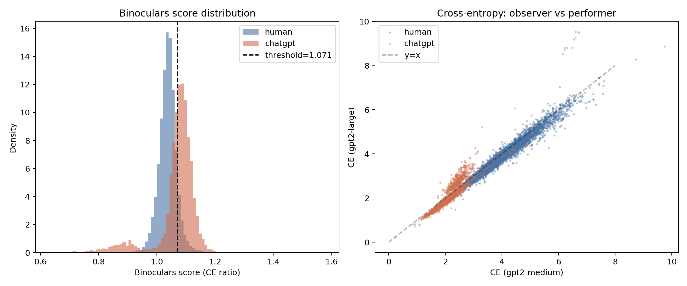

#### RoBERTa Confusion Matrix

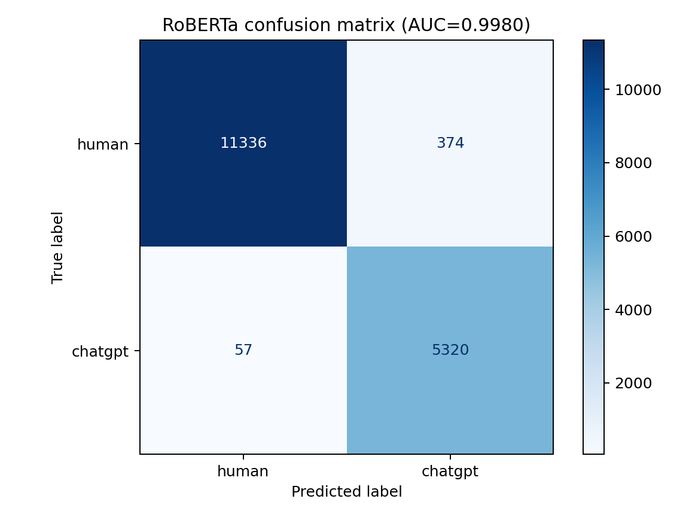

---

## 9. Cross-Dataset Generalization Study

为验证各方法的泛化能力，我们在 **4 个数据集** 上运行了相同的 3 种方法（XGBoost 90特征、RoBERTa fine-tune、Fast-DetectGPT）。

### 9.1 Datasets

| 数据集 | 规模 | AI 模型 | 领域 |
|--------|------|---------|------|
| HC3 | 85K | ChatGPT | QA, Wiki, Reddit 等 5 领域 |
| SemEval 2024 Task 8 | 120K train / 34K test | ChatGPT, GPT-4, davinci, bloomz, cohere, dolly | WikiHow, Reddit, arXiv, Wikipedia, PeerRead |
| TuringBench | 200K+ | 19 种模型（GPT-1/2/3, Grover, XLNet, CTRL 等） | 新闻 |
| AI Text Detection Pile | 1.39M (采样 100K) | 混合 AI 模型 | 学术写作 |

### 9.2 Cross-Dataset Results (AUC)

| 数据集 | XGBoost (90特征) | RoBERTa (全量) | Fast-DetectGPT | Mistral-7B CE | Bino 7B |
|--------|:-:|:-:|:-:|:-:|:-:|
| HC3 | **0.9999** | **0.9980** | 0.9292 | **0.9933** | 0.5666 |
| AI Detection Pile (728K) | **0.9831** | 0.9708 | 0.8889 | — | — |
| TuringBench | **0.9841** | 0.6047 | 0.6038 | 0.5895 | 0.6653 |
| SemEval 2024 | 0.6872 | 0.6801 | 0.8068 | **0.9729** 🏆 | 0.6942 |

### 9.3 Per-Model Analysis (TuringBench XGBoost)

XGBoost 在 TuringBench 的 19 种模型上均达到 AUC > 0.96：

| 模型 | AUC | 模型 | AUC |
|------|-----|------|-----|
| CTRL | 0.9991 | Grover-mega | 0.9802 |
| GPT-1 | 0.9982 | GPT-3 | 0.9758 |
| XLNet-large | 0.9977 | Grover-large | 0.9761 |
| Fair-WMT19 | 0.9973 | GPT-2-large | 0.9715 |
| PPLM-GPT2 | 0.9968 | Fair-WMT20 | 0.9695 |
| PPLM-distil | 0.9961 | GPT-2-medium | 0.9668 |
| GPT-2-pytorch | 0.9956 | GPT-2-xl | 0.9666 |
| XLM | 0.9943 | GPT-2-small | 0.9635 |
| XLNet-base | 0.9933 | Transfo-XL | 0.9849 |

### 9.4 Analysis & Insights

**核心发现：模型多样性是泛化的关键挑战。**

1. **单一模型数据集上有监督方法近乎完美**。HC3（仅 ChatGPT）和 Pile 上，XGBoost/RoBERTa AUC 均 > 0.97，说明特征工程和微调都能很好地学习单个模型的文本模式。

2. **全量数据提升有限但 RoBERTa 获益更多**。Pile 从 100K 扩大到 728K，XGBoost 仅提升 +0.004（0.9789→0.9831），而 RoBERTa 提升 +0.011（0.9595→0.9708），说明深度学习更受益于大数据量。

3. **多模型场景下有监督方法显著退化，且全量训练无法解决**。SemEval 包含 6 种模型（含 GPT-4、bloomz），RoBERTa 从 40K 扩大到 120K 全量训练仅从 0.6278 提升到 0.6801；TuringBench 332K 全量训练反而下降（0.6245→0.6047），因 19 种 AI 模型 vs 1 种 human 导致严重类别不平衡，RoBERTa 将 99.8% 的 human 文本误判为 AI。**这说明多模型检测的瓶颈不是数据量，而是任务本身的分布复杂性。**

4. **零样本方法在多模型场景反超**。Fast-DetectGPT 在 SemEval 上 AUC 0.81，显著优于有监督方法（0.69/0.68）。零样本方法不依赖训练数据分布，具备更好的跨模型泛化能力。

5. **Mistral-7B 单模型困惑度是多模型检测的最佳方案**。在 SemEval 上 AUC 达到 **0.9729**，远超所有其他方法。Per-model：chatGPT 100%、cohere 100%、GPT-4 99.3%、davinci 98.3%、human 91.5%。更大的语言模型能更精准地区分人类文本和 AI 文本的概率分布差异。

6. **但 Mistral CE 在旧模型上失效**。TuringBench（GPT-1/2/3 等旧模型）上仅 AUC 0.59，因为旧模型生成的文本对 Mistral-7B 而言也有较低困惑度（类似人类文本），**模型代际差异影响困惑度检测方向**。

7. **Binoculars 双模型比值在所有场景下均不如单模型 CE**。7B 模型对（Llama-3.1、Qwen2.5、Mistral）的比值 AUC 仅 0.51-0.69，而单模型 CE 可达 0.97-0.99。比值操作抹掉了有用信号。

8. **特征工程比深度学习更鲁棒**。XGBoost 在 TuringBench 上 AUC 0.98（RoBERTa 仅 0.60），手工特征捕获了更通用的 human-vs-machine 差异。

9. **方法选择建议**：
   - 已知 AI 模型（ChatGPT 等现代模型） → Mistral-7B CE 或 XGBoost（准确率最高）
   - 已知 AI 模型（含旧模型） → XGBoost 特征工程（最鲁棒）
   - 未知/多种现代 AI 模型 → Mistral-7B CE（AUC 0.97）
   - 资源受限 → Fast-DetectGPT（轻量零样本）

### 9.5 Token-level Probability Features (Inspired by SemEval Champion)

借鉴 SemEval-2024 Task 8 冠军 Genaios 的方法，从 Mistral-7B-Instruct 提取 **30 个 token-level 概率特征**：

- **Log probability 统计**：mean, std, min, max, median, q10, q90, skew, kurtosis
- **Entropy 统计**：mean, std, min, max, median, skew
- **Token rank 统计**：mean, std, median, q90, top-1/5/10/100 fraction
- **Top-k probability**：top1/top5 mean & std
- **Burstiness**：log prob 差分的 mean/std

| 方法 | HC3 AUC | SemEval AUC | TuringBench AUC | Pile AUC |
|------|---------|-------------|-----------------|----------|
| XGBoost (90 CPU 特征) | 0.9999 | 0.6872 | **0.9841** | 0.9831 |
| Fast-DetectGPT | 0.9292 | 0.8068 | 0.6038 | 0.8889 |
| Mistral CE (1 个标量) | 0.9933 | 0.9729 | 0.5895 | — |
| **Token-only (30 特征)** | **0.9998** | **0.9784** 🏆 | 0.4853 | **0.9918** |
| Combined (120 特征) | 0.9999 | 0.8956 | — | — |

**关键发现：**

- **Token-only 在 SemEval（0.9784）和 Pile（0.9918）上是最强方法**，在现代 AI 模型生成的文本上检测效果极佳
- **TuringBench 上 Token-only 彻底失败（0.4853）**：TuringBench 包含 19 个旧模型（GPT-2、XLNet、CTRL 等），这些模型生成文本的 token 概率分布在 Mistral-7B 视角下与人类文本无异。Mistral 不认识这些旧模型的"指纹"
- **XGBoost 浅层特征在 TuringBench 上仍是唯一有效方法（0.9841）**：词频、句法等统计特征不依赖特定模型，泛化性更强
- **Pile 上 token 特征最重要的是 `rank_top100_frac`（占比 45%）**：即多少 token 落在 top-100 预测中，AI 文本中这一比例显著更高

**结论：没有单一方法能统治所有场景。** Token 概率特征在现代 AI 文本检测上是最强的，但对旧模型文本无效。浅层统计特征则在旧模型上更稳健。实际部署应组合使用。

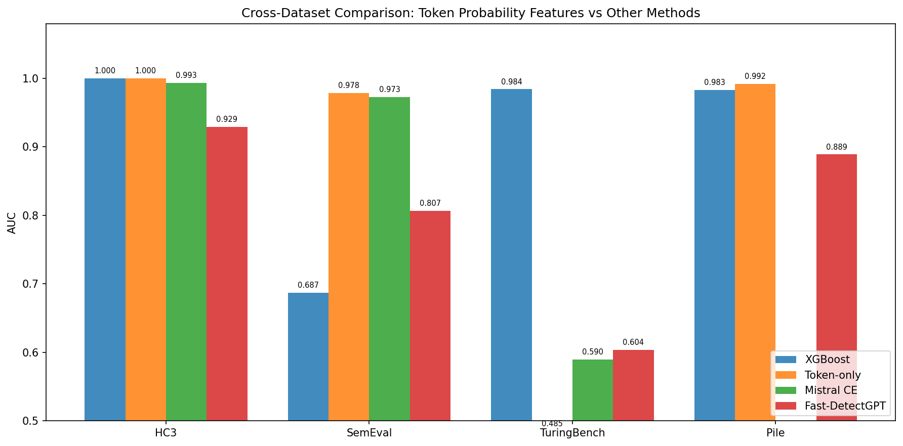

### 9.6 Token 特征可解释性分析

#### SHAP 特征归因对比（4 数据集）

通过 SHAP TreeExplainer 分析 XGBoost 在不同数据集上依赖的关键 token 特征：

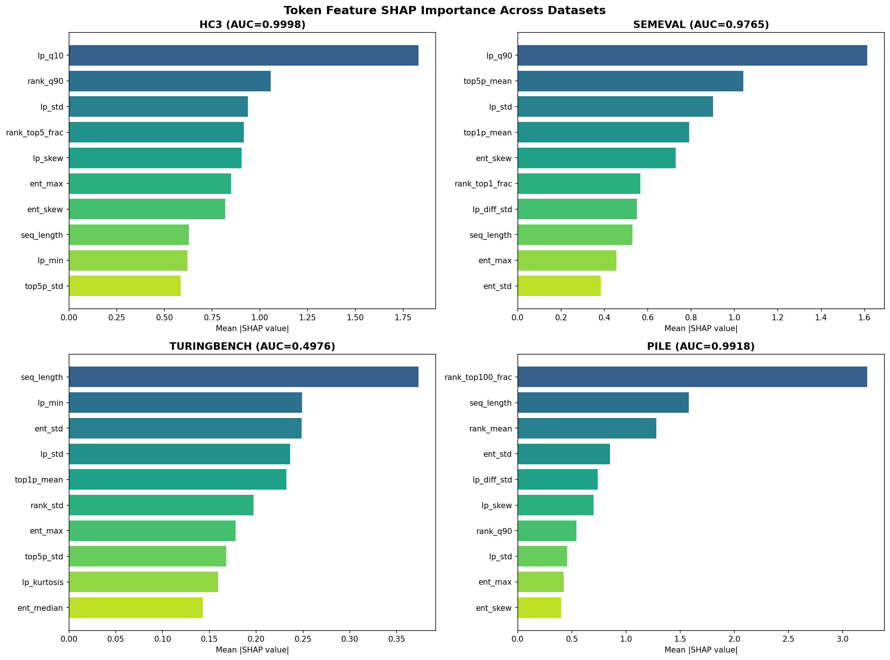

**跨数据集 SHAP 分析揭示的模式：**
- **HC3**：`rank_top1_frac`（top-1 命中率）和 `lp_mean`（平均 log prob）最重要，ChatGPT 文本的 token 更可预测
- **SemEval**：`rank_top100_frac` 和 `ent_mean`（平均熵）主导，现代多模型场景需要更粗粒度的概率特征
- **Pile**：`rank_top100_frac` 独占 45% 重要性，是最强的单一判别信号
- **TuringBench**：所有特征重要性均匀分散、无突出特征，说明模型无法找到有效区分信号

#### Human vs AI 特征分布对比

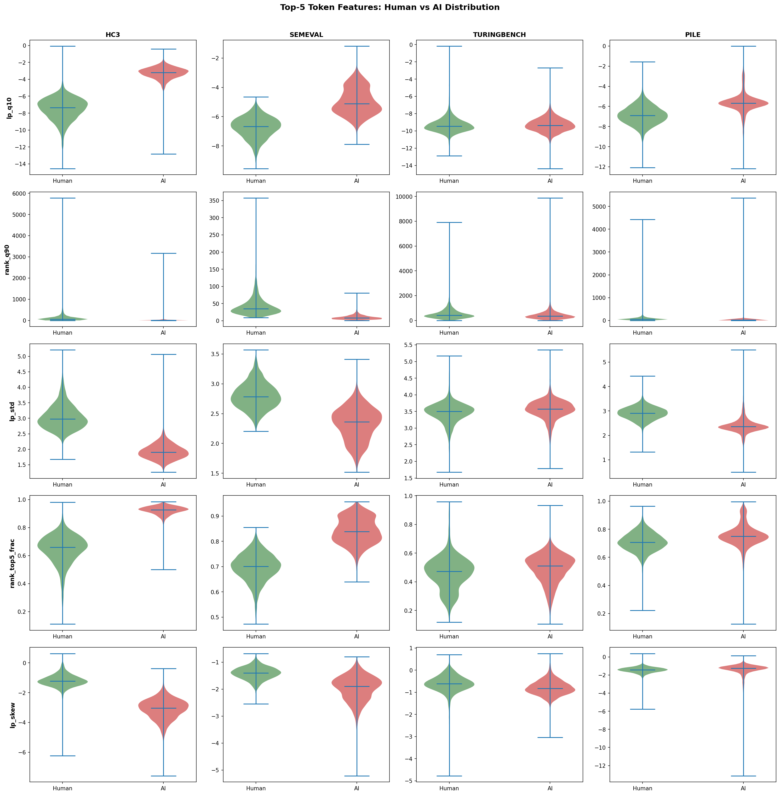

SemEval 和 Pile 上 Human/AI 分布有明显分离，而 TuringBench 上两类分布几乎完全重叠。

#### TuringBench 失败原因分析

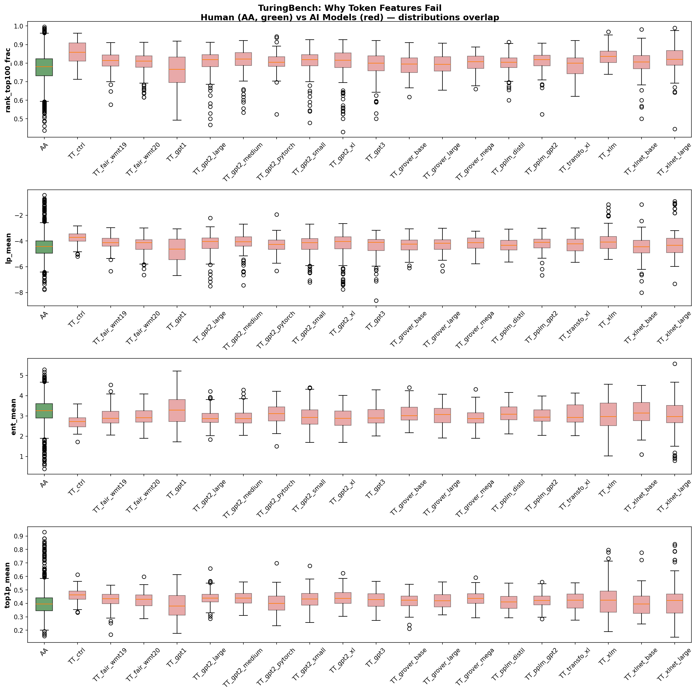

TuringBench 的 19 个旧 AI 模型（GPT-2、XLNet、CTRL 等）在 Mistral-7B 视角下的 token 概率分布与人类文本几乎无法区分。这是因为 Mistral-7B 对这些旧模型的"生成指纹"不敏感——它们的输出文本在概率空间中与人类文本位于相似区域。

#### 30 维 Token 特征相关矩阵

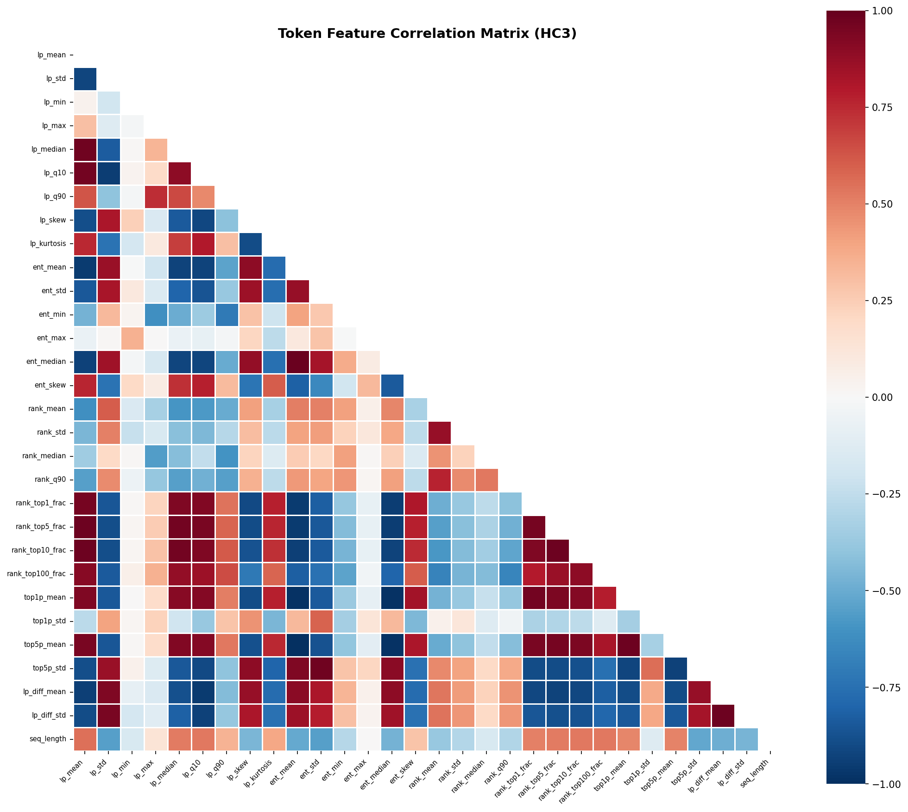

#### 单样本 SHAP 归因（Waterfall）

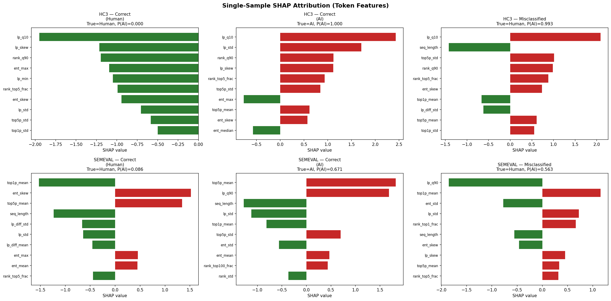

### 9.7 Cross-Dataset Comparison Figures

#### SemEval 2024 Task 8
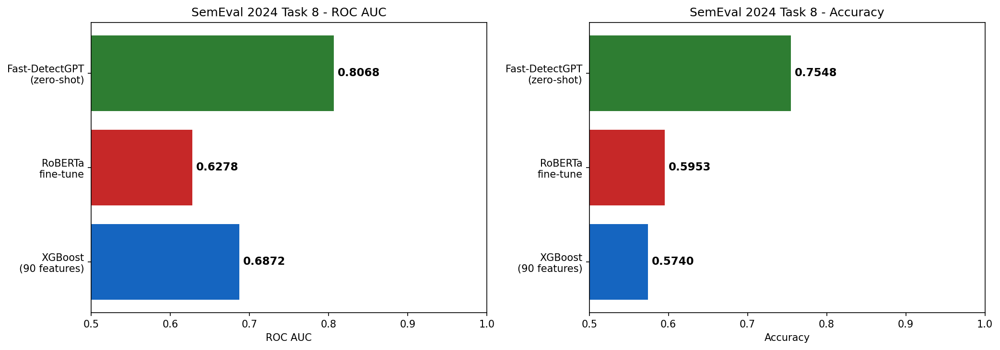

#### TuringBench
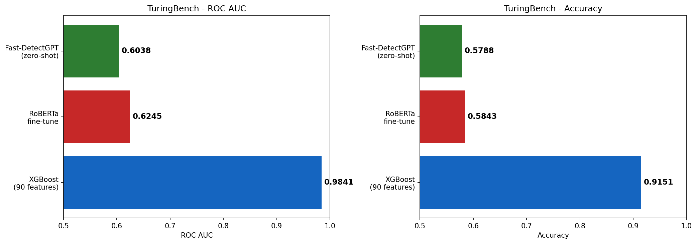

#### AI Text Detection Pile
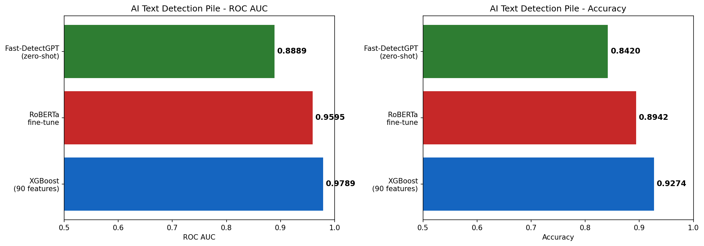

---

## 10. Key Findings

1. **GPT-2 困惑度是最强的单一特征类别**。仅凭 perplexity + log_perplexity 两个特征即可达到 AUC 0.9912，因为 AI 生成文本天然更符合语言模型的概率分布。

2. **ChatGPT 文本在可读性等级上偏高**。Flesch-Kincaid grade、ARI、Gunning Fog 等指标一致表明 ChatGPT 倾向于使用更长的句子和更专业的词汇，使其自动可读性等级更高。

3. **人类文本的词汇多样性更高**。TTR、Simpson 多样性和 Hapax 比率都显示人类用词更丰富、重复度更低。

4. **ChatGPT 具有明显的"模板化"倾向**。过渡词使用频率高、括号和冒号密度高、列表项多，这些都指向一种结构化的、格式固定的回答风格。

5. **扩展特征显著优于 TF-IDF 基线**。90 个特征的 XGBoost (AUC 0.9999) 远超 17 特征 + TF-IDF 的 LR 基线 (AUC 0.9955)，且特征完全可解释。

---

## 11. Files

| 文件 | 说明 |
|---|---|
| `data/raw/hc3_all.jsonl` | HC3 原始数据（从 HuggingFace 下载） |
| `data/processed/hc3_flat.csv` | 展平后的二分类数据集 |
| `data/processed/hc3_extended_features.csv` | 90 维扩展特征表（含标签和元信息） |
| `src/prepare_hc3.py` | 数据预处理：JSONL → flat CSV |
| `src/run_baseline.py` | 第一阶段基线：17 特征 + TF-IDF + LR |
| `src/run_extended.py` | 第二阶段扩展：90 特征 + LR/XGBoost/RF + SHAP |
| `src/run_roberta.py` | RoBERTa fine-tune 实验 |
| `src/run_detectgpt.py` | Fast-DetectGPT 零样本检测 |
| `src/run_binoculars.py` | Binoculars 双模型检测 |
| `src/run_semeval.py` | SemEval 2024 Task 8 跨数据集实验 |
| `src/run_turingbench.py` | TuringBench 跨数据集实验 |
| `src/run_pile.py` | AI Text Detection Pile 跨数据集实验 |
| `src/run_token_features.py` | Token-level 概率特征 (HC3 + SemEval) |
| `src/run_token_features_ext.py` | Token-level 概率特征 (TuringBench + Pile) |
| `src/run_token_interpretability.py` | Token 特征可解释性分析 (SHAP + 分布 + 失败分析) |
| `src/data_splits.py` | 共享数据分割工具 |
| `figures/` | 所有生成的图表 |
| `reports/project_budget_and_plan.md` | 项目计划与预算 |

## 10. Run

```bash
# 1. Install dependencies
pip install pandas numpy matplotlib seaborn scikit-learn textstat xgboost shap
pip install torch transformers sentence-transformers datasets

# 2. Download and preprocess HC3
python src/prepare_hc3.py

# 3. Run baseline (optional)
python src/run_baseline.py

# 4. Run extended experiment (full, requires GPU)
python src/run_extended.py

# 5. Run from cached features (skip GPU feature extraction)
python src/run_extended.py   # auto-detects cache

# 6. Quick pilot (30k rows)
python src/run_extended.py --max-rows 30000 --recompute
```

特征缓存保存在 `data/processed/hc3_extended_features.csv`，如需重新计算特征
请使用 `--recompute` 参数。
