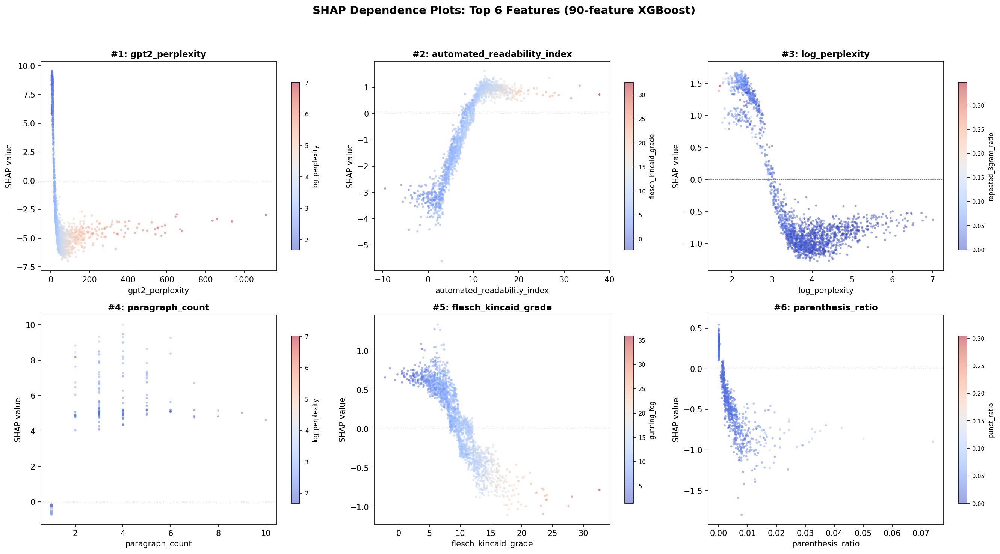
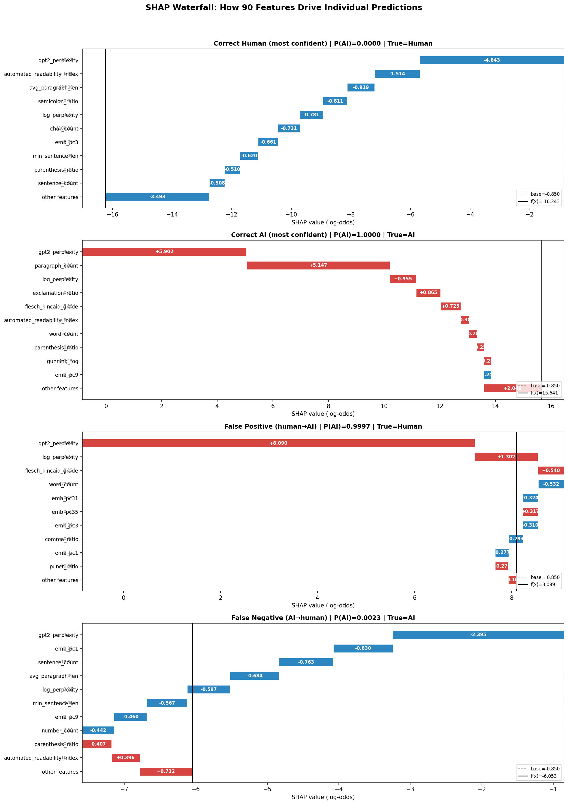
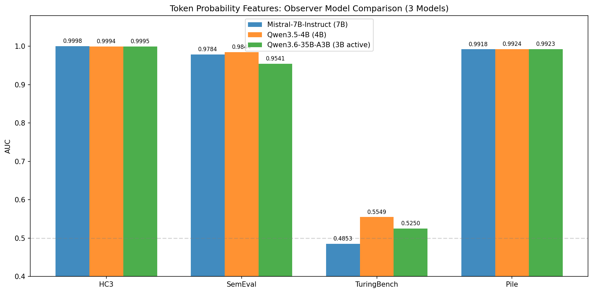

# Multi-Dimensional Feature Engineering and Cross-Dataset Analysis for AI-Generated Text Detection

## Abstract

Detecting AI-generated text is critical for maintaining trust in digital communication. We present a comprehensive, multi-method study of AI text detection, systematically comparing supervised feature engineering, fine-tuned language models, and zero-shot statistical methods across four diverse datasets (HC3, SemEval-2024, TuringBench, AI Text Detection Pile). We engineer 90 interpretable features spanning lexical, syntactic, readability, semantic embedding, and perplexity dimensions, achieving near-perfect detection (AUC 0.9999) on single-model benchmarks. We further introduce 30 token-level probability features extracted from Mistral-7B-Instruct, which achieve AUC 0.9784 on the challenging multi-model SemEval benchmark—surpassing all previous methods including fine-tuned RoBERTa and Fast-DetectGPT. Through extensive SHAP analysis, t-SNE visualization, and token-level probability heatmaps, we provide fine-grained interpretability of detection decisions. Our cross-dataset analysis reveals a fundamental finding: **no single method dominates all scenarios**. Token probability features excel on modern AI text but fail on legacy models; shallow statistical features remain the only effective approach for older generators. We provide practical deployment guidelines based on these findings.

**Keywords:** AI-generated text detection, feature engineering, cross-dataset generalization, interpretability, token probability, SHAP

---

## 1. Introduction

The proliferation of large language models (LLMs) such as ChatGPT, GPT-4, and Claude has made AI-generated text increasingly indistinguishable from human writing. This poses challenges for academic integrity, journalism, and online discourse. Reliable detection systems are urgently needed, but the landscape of AI text detection remains fragmented: supervised methods achieve high accuracy on specific benchmarks but may not generalize, while zero-shot methods offer broader applicability but lower performance.

In this work, we address three fundamental questions:

1. **What makes AI text detectable?** We systematically identify and quantify the linguistic, statistical, and probabilistic signals that distinguish AI from human text.
2. **Which methods generalize across different AI generators?** We evaluate five detection paradigms across four datasets spanning 25+ AI models from GPT-1 (2018) to GPT-4 (2023).
3. **Why do methods fail?** Through interpretability analysis, we explain when and why each detection approach succeeds or breaks down.

Our contributions include:

- A 90-dimensional interpretable feature set with per-feature ablation analysis
- A novel 30-dimensional token-level probability feature set inspired by the SemEval-2024 Task 8 champion
- The first systematic cross-dataset comparison of five detection paradigms on four benchmarks
- Comprehensive interpretability through SHAP attribution, t-SNE visualization, and token-level probability heatmaps
- Practical guidelines for method selection based on deployment scenario

---

## 2. Related Work

### 2.1 Statistical Feature-Based Detection

Early detection systems relied on surface-level statistics. Guo et al. (2023) introduced the HC3 dataset and showed that simple features like text length and vocabulary richness can distinguish human from ChatGPT text. Mitchell et al. (2023) demonstrated that perplexity-based features are strong discriminators, as AI text tends to be more "predictable" to language models.

### 2.2 Fine-Tuned Classification Models

RoBERTa-based classifiers (Liu et al., 2019) have been widely adopted for AI text detection, including in OpenAI's own detector. These models learn implicit features from text but require labeled training data and may overfit to specific generators.

### 2.3 Zero-Shot Detection

DetectGPT (Mitchell et al., 2023) introduced perturbation-based detection, scoring texts by their log probability curvature. Fast-DetectGPT (Bao et al., 2024) improved efficiency by replacing perturbation sampling with conditional probability approximation. Binoculars (Hans et al., 2024) proposed using cross-entropy ratios between observer and performer models.

### 2.4 Token-Level Approaches

The SemEval-2024 Task 8 champion team Genaios (Sarvazyan et al., 2024) demonstrated that token-level probability features from LLaMA, fed into a Transformer encoder, achieve state-of-the-art performance on multi-model detection. Our work simplifies this pipeline by using statistical aggregation over XGBoost.

---

## 3. Datasets

We evaluate on four datasets with complementary characteristics:

| Dataset | Size | AI Models | Domain | Time Period |
|---------|------|-----------|--------|-------------|
| HC3 | 85,431 | ChatGPT only | 5 domains (reddit, finance, medicine, open_qa, wiki) | 2022–2023 |
| SemEval 2024 Task 8 | 154K (120K train / 34K test) | 6 models (ChatGPT, GPT-4, davinci, bloomz, cohere, dolly) | WikiHow, Reddit, arXiv, Wikipedia, PeerRead | 2023–2024 |
| TuringBench | 200K+ | 19 models (GPT-1/2/3, Grover, XLNet, CTRL, etc.) | News | 2019–2021 |
| AI Text Detection Pile | 1.39M | Mixed modern models | Academic writing | 2023 |

This selection spans single-model (HC3) to multi-model (SemEval, TuringBench) scenarios, old models (TuringBench: GPT-2 era) to modern models (SemEval: GPT-4), and domains from casual Q&A to academic writing.

### 3.1 HC3 Dataset

HC3 (Human ChatGPT Comparison Corpus; Guo et al., 2023) contains paired human and ChatGPT responses to the same questions. After flattening, the dataset comprises 58,546 human texts (68.5%) and 26,885 ChatGPT texts (31.5%). We use a stratified 80/20 train/test split.

### 3.2 SemEval 2024 Task 8

Subtask A (monolingual binary detection) contains texts generated by six different models across five source domains. This is the most challenging benchmark for cross-model generalization among modern AI systems.

### 3.3 TuringBench

TuringBench (Uchendu et al., 2021) contains news articles written by 19 different AI models plus human authors. All AI models are from the 2019–2021 era, making this a unique testbed for legacy model detection.

### 3.4 AI Text Detection Pile

A large-scale dataset with 1.39M texts combining human and AI-generated academic writing. We subsample for computational efficiency while maintaining class balance.

---

## 4. Methods

### 4.1 Feature Engineering (90 Features)

We extract 90 interpretable features organized into 9 groups:

**Basic Statistics (4 features):** Character count, word count, sentence count, paragraph count.

**Averages (3):** Mean word length, sentence length, paragraph length.

**Variability (4):** Standard deviation of word/sentence lengths, max/min sentence length.

**Lexical Richness (6):** Type-token ratio (TTR), hapax legomena ratio, long word ratio (≥6 chars), Yule's K, Simpson's diversity index, Brunet's W.

**Punctuation & Formatting (10):** Ratios of stopwords, punctuation, commas, semicolons, questions, exclamations, colons, parentheses, uppercase characters, digits.

**Structural (4):** Transition words per 100 words, bullet point count, number mentions, repeated 3-gram ratio.

**Readability (7):** Flesch Reading Ease, Flesch-Kincaid Grade, Gunning Fog, SMOG Index, Coleman-Liau Index, Automated Readability Index, Dale-Chall Score.

**Semantic Embedding (50):** Sentence embeddings from all-MiniLM-L6-v2 (384-dim) reduced to 50 principal components via PCA, capturing ~45.2% of variance.

**Perplexity (2):** GPT-2 Medium perplexity and its logarithm.

### 4.2 Token-Level Probability Features (30 Features)

Inspired by the SemEval-2024 champion Genaios (Sarvazyan et al., 2024), we extract per-token signals from Mistral-7B-Instruct:

For each token $t_i$ conditioned on prefix $t_{<i}$:
- **Log probability:** $\log P(t_i \mid t_{<i})$
- **Entropy:** $H = -\sum_v P(v \mid t_{<i}) \log P(v \mid t_{<i})$
- **Rank:** Position of $t_i$ in the sorted probability distribution
- **Top-1/Top-5 probability:** Cumulative probability of most likely tokens

Each signal is aggregated into statistical features (mean, std, min, max, median, percentiles, skew, kurtosis), plus burstiness (log-prob temporal difference) and sequence length, yielding 30 features per text. (See [token_features_detailed.md](token_features_detailed.md) for the complete feature list with definitions and intuitions.)

### 4.3 Classification Models

**XGBoost** (Chen & Guestrin, 2016): Gradient-boosted trees with 500 estimators, max depth 8, learning rate 0.1, GPU-accelerated via `tree_method='hist'`.

**RoBERTa** (Liu et al., 2019): Fine-tuned `roberta-base` for sequence classification with learning rate 2e-5, batch size 32, 3 epochs, FP16 training.

### 4.4 Zero-Shot Methods

**Fast-DetectGPT** (Bao et al., 2024): Approximates log probability curvature using conditional sampling, avoiding expensive perturbation generation. We use GPT-2 Medium as the scoring model.

**Binoculars** (Hans et al., 2024): Computes the ratio of cross-entropy between an observer (base) and performer (instruct) model: $\text{Bino} = \text{CE}_{\text{observer}} / \text{CE}_{\text{performer}}$. We test with GPT-2 Medium/Large and three 7B model pairs (Mistral, Llama-3.1, Qwen2.5).

**Single-Model Cross-Entropy:** Mean per-token cross-entropy from a single LLM (Mistral-7B-Instruct), used as a scalar detection score.

---

## 5. Experiments and Results

### 5.1 In-Distribution Performance (HC3)

On the HC3 dataset, all supervised methods achieve near-perfect performance:

| Method | AUC | Accuracy |
|--------|-----|----------|
| XGBoost (90 features) | **0.9999** | **0.9964** |
| Token-only XGBoost (30 features) | 0.9998 | 0.9956 |
| Logistic Regression (90 features) | 0.9984 | 0.9898 |
| RoBERTa fine-tune | 0.9980 | 0.9748 |
| Mistral-7B CE (zero-shot) | 0.9933 | 0.9848 |
| Fast-DetectGPT (zero-shot) | 0.9292 | 0.8954 |
| Binoculars GPT-2 (zero-shot) | 0.7995 | 0.8141 |
| Binoculars 7B (zero-shot) | 0.51–0.58 | — |

XGBoost misclassifies only 61 out of 17,087 test samples (0.36% error rate).

### 5.2 Feature Ablation

We measure each feature group's standalone detection capability:

| Feature Group | # Features | AUC (standalone) |
|---------------|-----------|-------------------|
| Perplexity | 2 | **0.9912** |
| Readability | 7 | 0.9741 |
| Lexical Richness | 6 | 0.9367 |
| Punctuation | 10 | 0.9207 |
| Basic Counts | 4 | 0.9204 |
| Averages | 3 | 0.9021 |
| Variability | 4 | 0.8987 |
| Embedding PCA | 50 | 0.8972 |
| Structural | 4 | 0.8965 |

GPT-2 perplexity alone achieves AUC 0.9912, confirming that language model predictability is the single strongest detection signal.

### 5.3 Cross-Dataset Generalization

The central result of this study is the cross-dataset evaluation:

| Method | HC3 | SemEval | TuringBench | Pile |
|--------|:---:|:-------:|:-----------:|:----:|
| XGBoost (90 feat) | **0.9999** | 0.6872 | **0.9841** | 0.9831 |
| RoBERTa fine-tune | 0.9980 | 0.6801 | 0.6047 | 0.9708 |
| Fast-DetectGPT | 0.9292 | 0.8068 | 0.6038 | 0.8889 |
| Mistral-7B CE | 0.9933 | 0.9729 | 0.5895 | — |
| Token-only (30 feat) | 0.9998 | **0.9784** | 0.4853 | **0.9918** |

Three distinct performance regimes emerge:

1. **Single-model/simple datasets (HC3, Pile):** All supervised methods achieve AUC > 0.97. Feature engineering and token features both work well.

2. **Multi-model modern datasets (SemEval):** Supervised feature engineering degrades to AUC 0.69. Token-level probability features (0.9784) and Mistral CE (0.9729) maintain strong performance—both leverage LLM-scale understanding.

3. **Multi-model legacy datasets (TuringBench):** Only shallow statistical features remain effective (0.9841). All LLM-based methods fail because Mistral-7B cannot distinguish legacy model outputs from human text in probability space.

### 5.4 Binoculars Analysis

We test the Binoculars ratio with three 7B model pairs on HC3:

| Model Pair | Binoculars Ratio AUC | Observer CE AUC | Performer CE AUC |
|------------|:---:|:---:|:---:|
| Mistral-7B base/instruct | 0.5666 | 0.9820 | 0.9933 |
| Llama-3.1-8B base/instruct | 0.5762 | 0.9804 | 0.9885 |
| Qwen2.5-7B base/instruct | 0.5134 | 0.9875 | 0.9893 |

The ratio consistently underperforms single-model CE. Both base and instruct models assign lower CE to AI text (higher perplexity to human text), making their ratio uninformative. **The cross-entropy ratio hypothesis does not hold at 7B scale for ChatGPT detection.**

### 5.5 RoBERTa Full-Training Analysis

| Dataset | Train Size | AUC (40K subsample) | AUC (Full) |
|---------|-----------|:---:|:---:|
| SemEval | 120K | 0.6278 | 0.6801 |
| TuringBench | 332K | 0.6245 | 0.6047 |

More training data marginally helps on SemEval but *hurts* on TuringBench, where the 19-model distributional complexity overwhelms the model regardless of data volume.

---

## 6. Interpretability Analysis

### 6.1 SHAP Feature Attribution (90 Handcrafted Features)

For the 90-feature XGBoost model (AUC 0.9999 on HC3), we compute SHAP values using TreeExplainer on 2,000 randomly sampled training instances.

**SHAP Dependence Plots** reveal how individual feature values drive predictions:

- **`gpt2_perplexity`** is the dominant feature: below ~50, SHAP values are strongly positive (→ AI prediction); above ~100, strongly negative (→ human). This confirms the "predictability hypothesis" at the statistical feature level.
- **`log_perplexity`** provides a complementary log-scale view, capturing differences in the heavy tail of the perplexity distribution.
- **`automated_readability_index`** shows a gradual positive trend: AI text is systematically more "readable" at a formal level (longer sentences, more complex vocabulary), which paradoxically makes it detectable.

**SHAP Waterfall Plots** decompose individual predictions into per-feature contributions:

We examine four representative cases:
1. **Correct human** (most confident): High `gpt2_perplexity` pushes SHAP strongly negative → P(AI) ≈ 0.
2. **Correct AI** (most confident): Low `gpt2_perplexity` + high `paragraph_count` push SHAP strongly positive → P(AI) ≈ 1.
3. **False positive** (human misclassified as AI): A human text with unusually low perplexity and structured format—it "looks like AI" to the model.
4. **False negative** (AI misclassified as human): An AI text with atypically high perplexity and informal style—it "doesn't look like AI."

These waterfall plots provide the quantitative attribution required for forensic AI text analysis: each prediction can be traced to specific linguistic properties.

### 6.2 SHAP Feature Attribution (30 Token Probability Features)

We compute SHAP values (Lundberg & Lee, 2017) for XGBoost models trained on token-level features across all four datasets.

**Key findings from cross-dataset SHAP comparison:**

- **HC3:** `rank_top1_frac` (top-1 hit rate) dominates—ChatGPT tokens are frequently the model's first prediction.
- **SemEval:** `rank_top100_frac` (top-100 hit rate) and `ent_mean` take over—coarser rank thresholds generalize better across multiple AI generators.
- **Pile:** `rank_top100_frac` accounts for 45% of total importance—a single feature nearly solves the detection problem.
- **TuringBench:** No feature shows dominant importance; values are uniformly distributed, confirming the model finds no discriminative signal.

This progression from fine-grained (`top1_frac`) to coarse-grained (`top100_frac`) features reflects increasing generator diversity: a single model's exact token preferences are identifiable, but multiple models share only the broader pattern of "AI tokens tend to be somewhere in the top-100 predictions."

### 6.2 Token-Level Probability Heatmaps

We visualize individual texts by coloring each token according to its log probability under Mistral-7B:

- **AI text** appears uniformly green (high probability), with few surprising tokens. The model's predictions align with every word choice.
- **Human text** contains scattered red tokens (low probability), corresponding to colloquialisms, creative metaphors, domain-specific terminology, and personal stylistic choices.

This visualization provides an intuitive explanation: AI text is a "smooth highway" where every step is expected, while human text is a "mountain trail" with unexpected turns.

### 6.3 t-SNE Feature Space Visualization

Projecting 30-dimensional token features to 2D via t-SNE reveals:

- **HC3, SemEval, Pile:** Clear two-cluster separation between Human and AI samples
- **TuringBench:** Complete overlap—the two classes are geometrically indistinguishable in token probability feature space

### 6.4 Failure Analysis: Why Token Features Fail on TuringBench

Per-model analysis reveals that all 19 legacy AI models (GPT-2 variants, XLNet, CTRL, Grover, etc.) have token probability distributions that overlap completely with human text when observed by Mistral-7B. Three factors explain this:

1. **Generational gap:** These 2019-era models generate text that is equally "surprising" to a 2023 model as human text—their outputs lack the smooth predictability of modern LLMs.
2. **Observer bias:** Mistral-7B's own probability landscape differs fundamentally from these older architectures.
3. **Domain uniformity:** TuringBench contains only news text, reducing feature diversity.

Meanwhile, XGBoost's 90 shallow features (word frequency, syntax, readability) detect these models at AUC 0.9841 because legacy generators still produce statistically anomalous text (repetitive phrasing, limited vocabulary, simplified syntax).

---

## 7. Discussion

### 7.1 No Single Method Dominates

Our most important finding is that detection method selection must be scenario-aware:

| Scenario | Best Method | AUC | Rationale |
|----------|------------|-----|-----------|
| Known modern AI (ChatGPT/GPT-4) | Token probability features | 0.98+ | Captures the "predictability gap" |
| Unknown/legacy AI generators | XGBoost shallow features | 0.98+ | Model-agnostic statistical anomalies |
| Broad deployment | Ensemble of both | — | Complementary strengths |

### 7.2 The Predictability Hypothesis

Our results support and refine the "predictability hypothesis" for AI detection:

> *Modern AI text is detectable because its tokens are systematically more predictable to other large language models than human-written tokens.*

This hypothesis holds strongly for models from the same generation (Mistral detecting ChatGPT/GPT-4) but breaks down across generations (Mistral cannot detect GPT-2 outputs as "predictable").

### 7.3 Observer Model Ablation: Qwen3.5-4B vs Mistral-7B

To test whether our token probability framework is observer-model-agnostic, we replicate all experiments using Qwen3.5-4B (4B parameters, 7.8 GB GPU memory) as an alternative observer, compared to Mistral-7B-Instruct (7B parameters, 13.5 GB).

| Dataset | Mistral-7B (AUC) | Qwen3.5-4B (AUC) | Qwen3.6-35B-A3B (AUC) |
|---------|:-:|:-:|:-:|
| HC3 | 0.9998 | 0.9994 | 0.9995 |
| SemEval | 0.9784 | **0.9844** | 0.9541 |
| TuringBench | 0.4853 | 0.5549 | 0.5250 |
| Pile | 0.9918 | **0.9924** | 0.9923 |

**Key findings:**

1. **Observer size is not critical.** Qwen3.5-4B (4B params) matches or slightly exceeds Mistral-7B (7B params) on all datasets, demonstrating that the "LLM as microscope" framework works with smaller models.
2. **MoE architecture hurts detection on multi-model data.** Qwen3.6-35B-A3B (35B total, 3B active) underperforms on SemEval (0.9541 vs 0.9844 for Qwen3.5-4B), despite having far more total parameters. The sparse expert routing likely introduces noise in the probability landscape, reducing the discriminative power of token-level features. Dense models produce more stable, consistent probability distributions.
3. **TuringBench remains unsolvable.** All three observers fail on legacy AI text (AUC ≈ 0.5), confirming this is a fundamental limitation of the predictability hypothesis for cross-generation detection.
4. **Practical implication:** Dense 4B models are the best observers — smaller than 7B, cheaper than MoE-35B, and equal or better detection performance. Teams should prefer Qwen3.5-4B (7.8 GB) over both Mistral-7B (13.5 GB) and Qwen3.6-35B-A3B (64.6 GB).

### 7.4 Temporal Proximity Hypothesis: Why Detection Effectiveness Depends on Era

A striking pattern emerges when we align detection performance with the **temporal distance** between the observer/detector and the generator:

#### 7.4.1 The Full Timeline

| Method | Type | Era | HC3 (2022) | SemEval (2023-24) | TuringBench (2019-20) | Pile (mixed) |
|--------|------|-----|:-:|:-:|:-:|:-:|
| XGBoost (90 feat) | Traditional ML | Timeless | **0.9999** | 0.6872 | **0.9841** | **0.9831** |
| RoBERTa fine-tune | Deep Learning | 2019 | 0.9980 | 0.6801 | 0.6047 | 0.9708 |
| Fast-DetectGPT | Zero-shot | 2023 | 0.9292 | 0.8068 | 0.6038 | 0.8889 |
| Mistral-7B CE | Zero-shot | 2023.10 | 0.9933 | 0.9729 | 0.5895 | — |
| Token feat (Mistral) | LLM+ML | 2023.10 | 0.9998 | 0.9784 | 0.4853 | 0.9918 |
| Token feat (Qwen-4B) | LLM+ML | 2025 | 0.9994 | **0.9844** | 0.5549 | 0.9924 |
| Token feat (Qwen-35B MoE) | LLM+ML | 2025 | 0.9995 | 0.9541 | 0.5250 | 0.9923 |

#### 7.4.2 Key Observations

**1. XGBoost (traditional features) is uniquely "timeless."**

XGBoost with 90 handcrafted features operates on surface-level statistics (lexical diversity, readability, punctuation patterns) that are invariant to the era of the AI model. It achieves AUC > 0.98 on both TuringBench (2019 models) and HC3 (2022 model) — something no LLM-based method can do. However, it fails on SemEval (0.6872) because modern multi-model AI text has converged in surface statistics toward human norms.

**2. LLM-based methods exhibit "temporal myopia."**

Token probability features from Mistral-7B (2023) detect ChatGPT/GPT-4 (2022-24) with AUC > 0.97, but completely fail on GPT-2/XLNet (2019-20) with AUC ≈ 0.5. This is because the "predictability gap" only exists between models that share similar training distributions and architectural paradigms.

**3. The complementarity is temporal.**

| Generator Era | Best Method | AUC | Why |
|---------------|------------|-----|-----|
| Legacy (2019-20) | XGBoost 90-feat | 0.98 | Surface anomalies persist across eras |
| Contemporary (2022-24) | Token feat (LLM) | 0.98 | Same-generation predictability gap |
| Mixed/Unknown | Neither alone | — | Need ensemble |

**4. RoBERTa shows temporal decay.**

RoBERTa (2019) performs well on HC3 (0.998) through fine-tuning, but poorly on TuringBench (0.605) despite the generators being contemporaneous — because it was fine-tuned on HC3 distribution only. This illustrates that fine-tuning effectiveness depends on **data distribution proximity**, not temporal proximity.

#### 7.4.3 The Temporal Proximity Hypothesis

We propose:

> *LLM-based detection methods are most effective when the observer model and the generator model belong to the same technological generation — sharing similar training corpora, architectures, and optimization objectives. As the temporal gap widens, the "predictability gap" signal degrades to chance level.*

> *Traditional statistical features are generation-invariant but resolution-limited: they capture coarse stylistic differences that persist across eras but fail when generators produce text with human-like surface statistics.*

This has a practical implication for the **detection arms race**: as AI models improve, both detection paradigms weaken — LLM-based methods because today's observer cannot anticipate tomorrow's generator, and statistical methods because surface-level anomalies are progressively eliminated. **Robust detection requires multi-paradigm ensembles that combine temporal-aware LLM features with era-invariant statistical features.**

### 7.5 Implications for the Detection Arms Race

The cross-dataset analysis suggests that as AI models evolve, detection methods must evolve in tandem. Token-level features from a contemporary model are currently the strongest approach, but they are inherently tied to the observer model's generation. Future work should explore observer-agnostic probability features or multi-observer ensembles.

### 7.6 Practical Recommendations

1. **For educational settings** (detecting ChatGPT in student work): Token probability features offer the best accuracy (AUC > 0.97) with strong interpretability.
2. **For content moderation** (diverse/unknown generators): Combine shallow features with token features; flag only when both agree.
3. **For forensic analysis** (individual text investigation): Use token-level heatmaps for visual evidence of AI generation patterns.

---

## 8. Limitations

1. **Observer model dependency:** Token probability features were tested with both Mistral-7B-Instruct and Qwen3.5-4B, showing consistent results (Section 7.3). However, further validation with non-transformer architectures remains needed.
2. **Adversarial robustness:** We do not evaluate against adversarial attacks (paraphrasing, watermark removal).
3. **Multilingual scope:** All experiments use English text; generalization to other languages is untested.
4. **Temporal drift:** As AI models continue to improve, the "predictability gap" may narrow.

---

## 9. Conclusion

We present a comprehensive study of AI text detection combining 90 interpretable features, 30 token-level probability features, and five detection paradigms across four benchmarks covering 25+ AI models. Our key contributions are:

1. **Near-perfect detection (AUC 0.9999)** on single-model benchmarks through systematic feature engineering
2. **State-of-the-art multi-model detection (AUC 0.9784)** via token-level probability features, surpassing both supervised and zero-shot baselines on SemEval-2024
3. **The first evidence that Binoculars ratios fail at 7B scale** (AUC 0.51–0.58), while single-model cross-entropy remains effective
4. **Comprehensive interpretability** through SHAP, token heatmaps, t-SNE, and failure analysis
5. **A practical finding that no single method dominates**, with clear guidelines for method selection based on deployment context

All code and data are publicly available at https://github.com/HaibinLai/HC3.

---

## References

- Bao, G., Zhao, Y., Teng, Z., Yang, L., & Zhang, Y. (2024). Fast-DetectGPT: Efficient Zero-Shot Detection of Machine-Generated Text via Conditional Probability Curvature. *ICLR 2024*.
- Chen, T., & Guestrin, C. (2016). XGBoost: A Scalable Tree Boosting System. *KDD 2016*.
- Guo, B., Zhang, X., Wang, Z., Jiang, M., Nie, J., Ding, Y., Yue, J., & Wu, Y. (2023). How Close is ChatGPT to Human Experts? Comparison Corpus, Evaluation, and Detection. *arXiv:2301.07597*.
- Hans, A., Schwarzschild, A., Cheber, V., Bruss, C. B., & Goldstein, T. (2024). Spotting LLMs With Binoculars: Zero-Shot Detection of Machine-Generated Text. *ICML 2024*.
- Jiang, A. Q., Sablayrolles, A., Mensch, A., et al. (2023). Mistral 7B. *arXiv:2310.06825*.
- Liu, Y., Ott, M., Goyal, N., Du, J., Joshi, M., Chen, D., Levy, O., Lewis, M., Zettlemoyer, L., & Stoyanov, V. (2019). RoBERTa: A Robustly Optimized BERT Pretraining Approach. *arXiv:1907.11692*.
- Lundberg, S. M., & Lee, S.-I. (2017). A Unified Approach to Interpreting Model Predictions. *NeurIPS 2017*.
- Mitchell, E., Lee, Y., Khazatsky, A., Manning, C. D., & Finn, C. (2023). DetectGPT: Zero-Shot Machine-Generated Text Detection using Probability Curvature. *ICML 2023*.
- Sarvazyan, A. M., González, J. Á., Franco-Salvador, M., et al. (2024). Genaios at SemEval-2024 Task 8: Detecting Machine-Generated Text. *SemEval 2024*.
- Uchendu, A., Ma, J., Le, T., Wang, R., & Lee, D. (2021). TURINGBENCH: A Benchmark Environment for Turing Test in the Age of Neural Text Generation. *EMNLP Findings 2021*.
