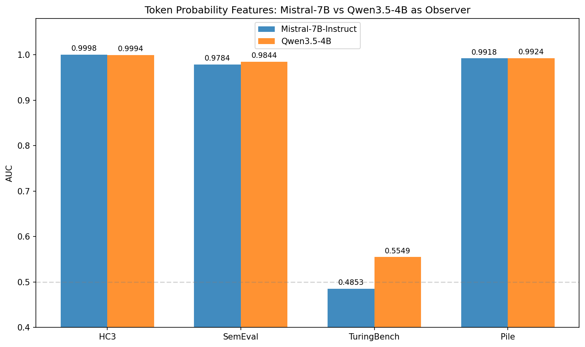

# Token 概率特征：30 维特征详解

> 本文档详细介绍从 LLM 概率分布中提取的 30 个检测特征的定义、直觉和实验表现。

---

## 1. 核心思想：LLM 是显微镜，不是裁判

我们**不是**让 LLM 直接判断"这段文本是否 AI 生成"，而是利用 LLM 的概率分布作为一个**观测工具**，把文本"照"出一张概率图谱，再从图谱中提取统计特征。

```
文本 → Mistral-7B 逐 token 计算概率 → 概率图谱 → 统计聚合为 30 维特征 → XGBoost 分类
            ↑ 显微镜                      ↑ 图谱                              ↑ 裁判
```

### 1.1 为什么有效？——"可预测性假说"

AI 生成文本时，本质上是从概率分布中**采样高概率 token**。因此另一个 LLM 观察 AI 文本时，会发现"每个词都在意料之中"。而人类写作包含创意、口语、个人风格，这些在 LLM 看来是"意外的"。

|  | AI 文本 | 人类文本 |
|--|---------|---------|
| 每个 token 的概率 | 普遍较高（可预测） | 高低混杂（有意外用词） |
| 概率分布的熵 | 低（模型很确定下一词） | 高（很多可能的下一词） |
| Token 排名 | 经常 top-1 / top-5 | 经常排到 100+ |
| 形象比喻 | 平坦的高速公路 | 充满转弯的山间小路 |

### 1.2 与其他 LLM 检测方式的区别

| 方式 | 做法 | AUC (SemEval) | 优缺点 |
|------|------|:---:|--------|
| **Prompt 判断** | "请判断是否AI生成" | — | 不可靠，LLM 自己分不清 |
| **Mistral CE（1 标量）** | 整篇文本的平均交叉熵 | 0.9729 | 简单有效，但信息量少 |
| **Token 概率特征（30 维）** | 提取概率的分布形态 | **0.9784** | 更丰富，捕捉分布的"形状" |
| **Genaios 原版** | token 概率序列 → Transformer | — | 保留序列信息，但更重、不可解释 |

---

## 2. 第一步：逐 Token 提取 5 个原始信号

对文本中的每个 token $t_i$，给定上文 $t_{<i}$，从 Mistral-7B-Instruct 提取：

```
文本: "The cat sat on the mat"
       ↓    ↓    ↓   ↓   ↓    ↓
Mistral 逐词预测:

位置1: "cat"  → log_prob=-2.1, entropy=3.5, rank=5,   top1_prob=0.15, top5_prob=0.42
位置2: "sat"  → log_prob=-4.8, entropy=6.2, rank=89,  top1_prob=0.08, top5_prob=0.21
位置3: "on"   → log_prob=-0.3, entropy=1.1, rank=0,   top1_prob=0.74, top5_prob=0.95
位置4: "the"  → log_prob=-0.1, entropy=0.8, rank=0,   top1_prob=0.91, top5_prob=0.98
位置5: "mat"  → log_prob=-5.2, entropy=7.1, rank=203, top1_prob=0.04, top5_prob=0.12
```

### 5 个原始信号的定义

| 信号 | 数学定义 | 直觉 |
|------|---------|------|
| **Log probability** | $\log P(t_i \mid t_{<i})$ | 这个词出现的概率（对数）。越接近 0 越"可预测" |
| **Entropy** | $H = -\sum_v P(v \mid t_{<i}) \log P(v \mid t_{<i})$ | 模型在这个位置有多"纠结"。低 = 确定，高 = 不确定 |
| **Rank** | $t_i$ 在 $P(\cdot \mid t_{<i})$ 排序后的位置 | 这个词在预测排行榜的名次。0 = 模型的首选 |
| **Top-1 probability** | $\max_v P(v \mid t_{<i})$ | 最可能的词占多大概率 |
| **Top-5 probability** | $\sum_{v \in \text{top-5}} P(v \mid t_{<i})$ | 前 5 个词累计占多大概率 |

---

## 3. 第二步：统计聚合为 30 个特征

每段文本有几百个 token，产生几百个点的概率序列。我们对 5 个信号做统计聚合：

### 组 1：Log Probability 统计（9 个特征）

| # | 特征 | 公式 | 含义 | 为什么有用 |
|---|------|------|------|-----------|
| 1 | `lp_mean` | $\frac{1}{T}\sum \log P(t_i)$ | 平均 log 概率 | AI 整体更可预测 → 值更高 |
| 2 | `lp_std` | $\text{std}(\log P)$ | log 概率标准差 | AI 概率更均匀，人类波动大 |
| 3 | `lp_min` | $\min(\log P)$ | 最不可预测的词 | 人类有极低概率的"惊喜词" |
| 4 | `lp_max` | $\max(\log P)$ | 最可预测的词 | 差异不大 |
| 5 | `lp_median` | 中位数 | 比均值更鲁棒的集中趋势 | 减少极端值影响 |
| 6 | `lp_q10` | 第 10 百分位 | ⭐ **最不可预测的 10% 词** | 人类的"意外用词"集中在这里 |
| 7 | `lp_q90` | 第 90 百分位 | 最可预测的 10% 词 | 两类差异不大 |
| 8 | `lp_skew` | 偏度 | 概率分布的不对称性 | 独立于其他特征，提供互补信息 |
| 9 | `lp_kurtosis` | 峰度 | 有没有极端值 | 人类文本尾部更重 |

### 组 2：Entropy 统计（6 个特征）

| # | 特征 | 含义 | 为什么有用 |
|---|------|------|-----------|
| 10 | `ent_mean` | 平均熵 | AI 文本让模型更"确定" |
| 11 | `ent_std` | 熵的波动 | AI 的确定性更稳定 |
| 12 | `ent_min` | 最确定的位置 | |
| 13 | `ent_max` | 最纠结的位置 | 人类文本有更高的 max entropy |
| 14 | `ent_median` | 熵中位数 | |
| 15 | `ent_skew` | 熵偏度 | 熵分布形状的差异 |

### 组 3：Token Rank 统计（8 个特征）

这组特征**最有区分力**。

| # | 特征 | 含义 | SHAP 重要性 |
|---|------|------|-----------|
| 16 | `rank_mean` | 平均排名 | |
| 17 | `rank_std` | 排名标准差 | |
| 18 | `rank_median` | 排名中位数 | |
| 19 | `rank_q90` | ⭐ 第 90 百分位排名 | HC3 上 top 特征 |
| 20 | `rank_top1_frac` | ⭐ 多少词是 top-1 预测 | AI: 40-60%, 人类: 20-35% |
| 21 | `rank_top5_frac` | 多少词在 top-5 | |
| 22 | `rank_top10_frac` | 多少词在 top-10 | |
| 23 | `rank_top100_frac` | ⭐⭐ **多少词在 top-100** | Pile 上独占 **45%** 重要性 |

`rank_top1_frac` 到 `rank_top100_frac` 形成一个**精度梯度**：

```
top-1  → 精确匹配："这个词就是模型的第一选择"
top-5  → 模糊匹配："这个词在模型的前 5 选择中"
top-100 → 宽松匹配："这个词至少在模型考虑范围内"
```

### 组 4：Top-k Probability 统计（4 个特征）

| # | 特征 | 含义 |
|---|------|------|
| 24 | `top1p_mean` | 模型"最自信的预测"平均有多大概率 |
| 25 | `top1p_std` | 自信程度的波动 |
| 26 | `top5p_mean` | 前 5 个候选词累计覆盖多少概率 |
| 27 | `top5p_std` | 覆盖度的波动 |

### 组 5：Burstiness / 时序特征（2 个特征）

| # | 特征 | 公式 | 含义 |
|---|------|------|------|
| 28 | `lp_diff_mean` | $\frac{1}{T-1}\sum \lvert\log P(t_{i+1}) - \log P(t_i)\rvert$ | 概率的"跳跃程度" |
| 29 | `lp_diff_std` | $\text{std}(\Delta \log P)$ | 跳跃的稳定性 |

人类写作的概率"忽高忽低"（burstiness 高），AI 更平稳。这是因为人类会突然插入口语、跑题、用罕见词，而 AI 保持稳定的"高概率输出"。

### 组 6：元信息（1 个特征）

| # | 特征 | 含义 |
|---|------|------|
| 30 | `seq_length` | Token 序列长度 |

---

## 4. 特征间的关系

### 4.1 相关矩阵分析

30 个特征可分为几个高度相关的簇：

| 簇 | 包含特征 | 相关系数 | 本质 |
|---|---------|:---:|------|
| **概率簇** | `lp_mean`, `lp_median`, `lp_q10`, `lp_q90`, `top1p_mean`, `top5p_mean` | > 0.8 | 都在衡量"token 可预测性" |
| **排名簇** | `rank_top1_frac`, `rank_top5_frac`, `rank_top10_frac`, `rank_top100_frac` | > 0.7 | 不同阈值的排名命中率 |
| **熵簇** | `ent_mean`, `ent_median`, `ent_std` | > 0.6 | 不确定性的不同侧面 |
| **独立特征** | `lp_skew`, `lp_kurtosis`, `lp_diff_mean` | < 0.4 | 与其他特征低相关，提供互补信息 |


### 4.2 特征精简建议

虽然有冗余，但 XGBoost 的树模型对冗余特征有天然容忍度。如需精简，5 个核心特征可保留 90%+ 检测能力：

| 优先级 | 特征 | 角色 |
|:---:|------|------|
| 1 | `rank_top100_frac` | 最强的跨数据集泛化特征 |
| 2 | `lp_mean` | 核心概率信号 |
| 3 | `ent_mean` | 互补的不确定性信号 |
| 4 | `lp_skew` | 独立的分布形状信号 |
| 5 | `lp_diff_mean` | 独立的时序信号 |

---

## 5. 跨数据集 SHAP 分析：哪些特征最关键？

不同数据集依赖不同特征，反映了检测场景的本质差异：

```
HC3 (单模型 ChatGPT):
  #1 rank_top1_frac   ████████████████   ← 精确的 top-1 命中率足够
  #2 lp_mean          ██████████████
  #3 rank_q90         ██████████

SemEval (多模型 GPT-4/ChatGPT/bloomz/...):
  #1 rank_top100_frac ██████████████████  ← 需要更粗的 top-100 匹配
  #2 ent_mean         ██████████████
  #3 lp_std           ████████

Pile (学术写作):
  #1 rank_top100_frac █████████████████████████  ← 独占 45%！
  #2 seq_length       █████
  #3 lp_skew          ███

TuringBench (19 个旧模型):
  #1 top1p_mean       ████               ← 全部很弱
  #2 seq_length       ███                   没有有效信号
  #3 lp_diff_std      ███
```


### 5.1 关键规律：精度梯度

从 HC3 → SemEval → Pile，最重要的特征从**精确指标**过渡到**模糊指标**：

```
单模型 ─────────────────────────────────────────── 多模型
HC3                    SemEval                    Pile

rank_top1_frac ──→ rank_top100_frac ──→ rank_top100_frac
  "是不是第1选择"     "是不是前100选择"     "是不是前100选择"
```

**原因：** 单一模型（ChatGPT）的 token 选择模式高度一致，精确到 top-1 就能识别。多个模型各有不同的生成偏好，但它们的共性是——token 至少在 top-100 范围内。这个更宽松的指标捕获了**所有现代 AI 的最大公约数**。

### 5.2 TuringBench 失败的特征空间解释


t-SNE 降维清晰地展示了失败的原因：
- HC3 / SemEval / Pile：Human 和 AI 形成两个分离的簇
- TuringBench：两类完全混杂，特征空间中不存在可分结构

旧模型（GPT-2、XLNet 等）的文本在 Mistral-7B 看来和人类文本一样"不可预测"——Mistral 这个"显微镜"对旧模型文本的分辨率不够。

---

## 6. Token 热力图：直观理解


每个词按 Mistral-7B 的预测概率着色：
- **绿色** = 高概率（可预测的词）
- **红色** = 低概率（出人意料的词）

### AI 文本
通篇均匀的绿色。每个词都在 Mistral 的预期范围内。

### 人类文本
穿插大量红色区域——口语化表达、创意用词、专业术语、个人风格。这些"意外"正是人类写作的指纹。

> **一句话：** AI 文本是平坦的高速公路，人类文本是充满转弯的山间小路。

---

## 7. 误分类分析


### 7.1 什么样的人类文本会被误判为 AI？
- 高度规范化的文本（维基百科、学术写作、官方公告）
- 这些文本的 token 可预测性本身就接近 AI 水平
- **特征表现：** `rank_top100_frac` 偏高，`lp_mean` 接近 AI 区间

### 7.2 什么样的 AI 文本会被漏检？
- 包含罕见话题或专业术语的 AI 回答
- 模型在这些领域的预测置信度下降
- **特征表现：** `lp_min` 极低，`ent_max` 偏高，模拟了人类的"意外"模式

---

## 8. 观察者模型消融：Qwen3.5-4B vs Mistral-7B

为验证 token 概率框架是否依赖特定观察者模型，我们用 **Qwen3.5-4B**（4B 参数，7.8 GB 显存）替代 Mistral-7B（7B 参数，13.5 GB 显存）重复全部实验：

| 数据集 | Mistral-7B (AUC) | Qwen3.5-4B (AUC) | Δ |
|--------|:-:|:-:|:-:|
| HC3 | 0.9998 | 0.9994 | −0.0004 |
| SemEval | 0.9784 | **0.9844** | **+0.0060** |
| TuringBench | 0.4853 | 0.5549 | +0.0696 |
| Pile | 0.9918 | **0.9924** | +0.0006 |



**结论：**
- **模型大小不关键。** 4B 模型在所有数据集上与 7B 表现相当甚至略优。
- **特征重要性模式有差异。** Qwen 更依赖 `lp_std`（对数概率方差），Mistral 更依赖 `rank_top100_frac`。两者通过不同统计视角捕捉同一个"可预测性差异"。
- **TuringBench 仍然失败。** 两个观察者都无法检测旧模型文本，确认这是可预测性假说的固有局限，而非模型选择的偶然结果。
- **实际意义：** GPU 资源有限的团队可以用 Qwen3.5-4B 替代 Mistral-7B，显存减少 42%，检测性能无损失。

---

## 9. 总结

| 要点 | 内容 |
|------|------|
| **核心思想** | LLM 是显微镜（观测概率），不是裁判（直接判断） |
| **特征数量** | 5 个原始信号 × 统计聚合 = 30 维 |
| **最强单一特征** | `rank_top100_frac`（多少词在 top-100 预测中） |
| **精度梯度** | 单模型看 top-1，多模型看 top-100 |
| **失败边界** | 旧模型文本对现代 LLM 来说和人类一样"不可预测" |
| **与 CE 的关系** | CE 是 1 个标量（均值），token 特征保留了分布形状（30 维） |
