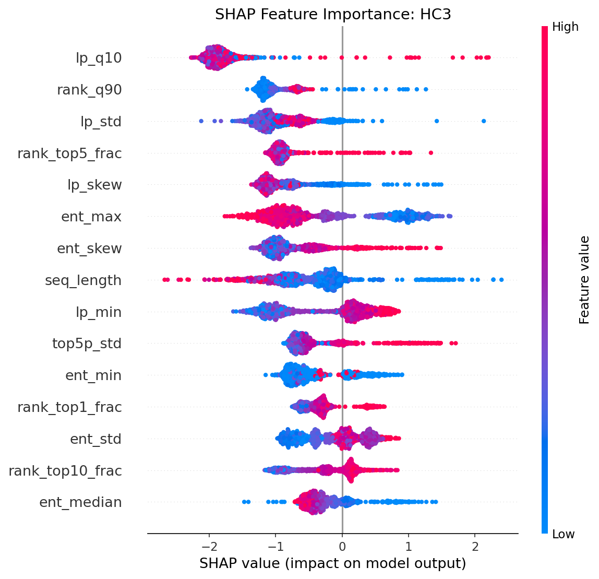
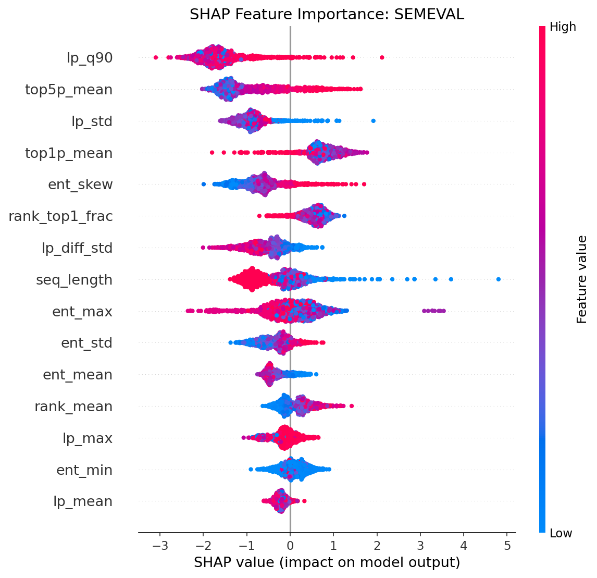
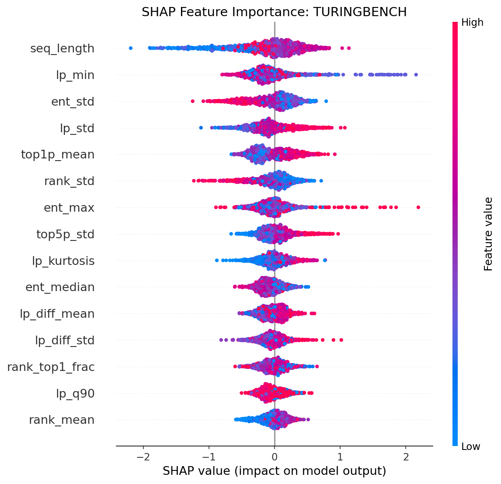
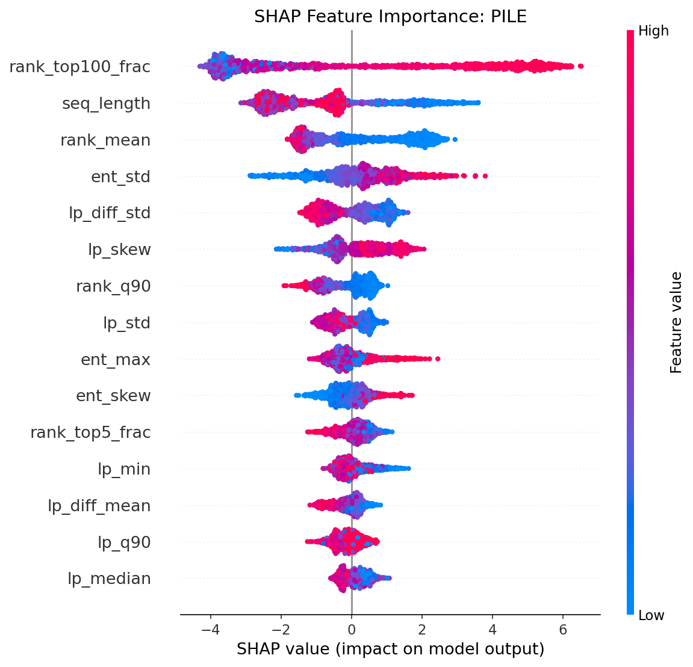
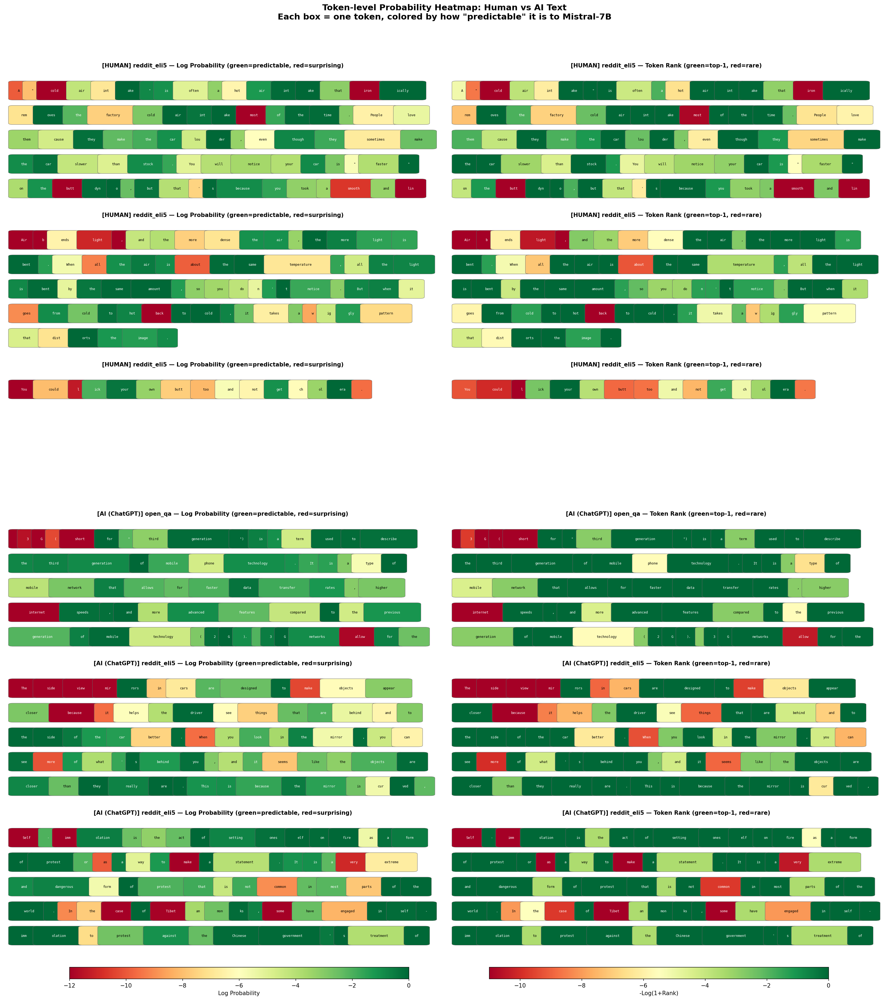
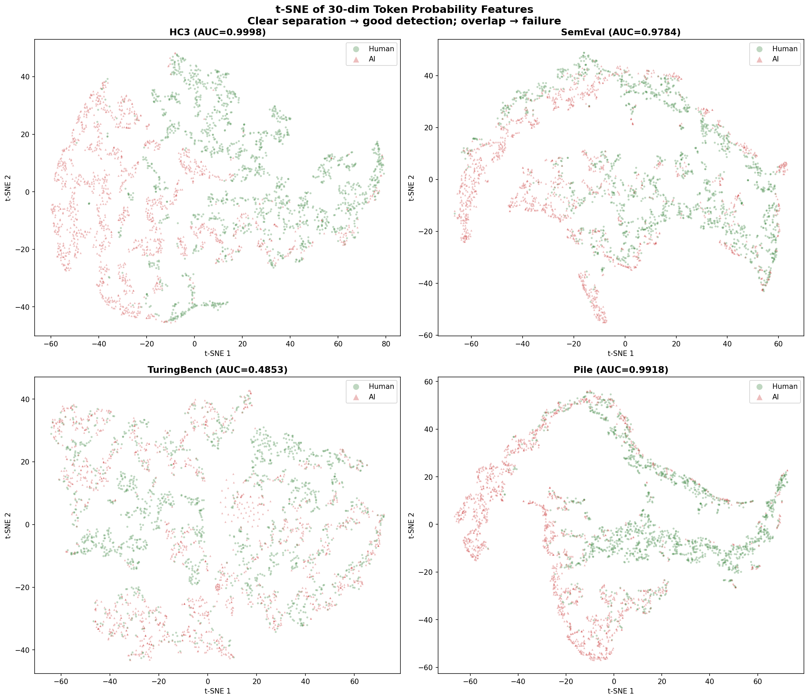
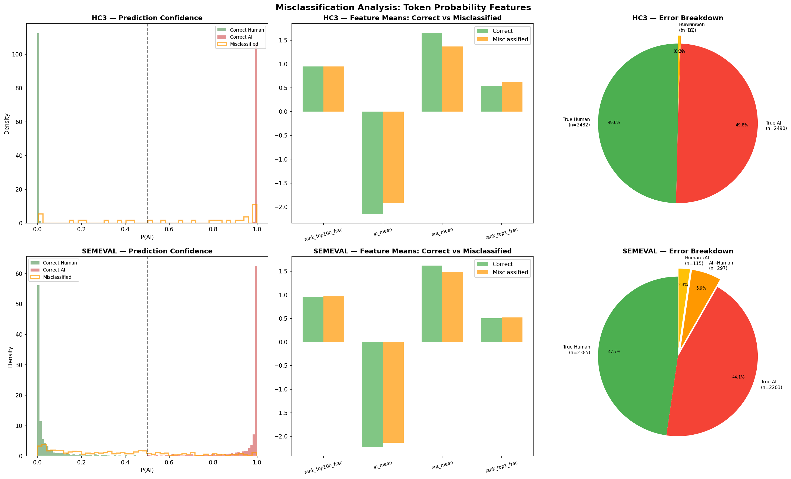

# Token-level Probability Features: Interpretability Report

> 本报告详细分析了基于 Mistral-7B-Instruct 的 30 维 token-level 概率特征在 AI 文本检测中的可解释性，涵盖 4 个数据集的 SHAP 归因、特征分布对比、失败原因分析和单样本级别归因。

---

## 1. 方法概述

### 1.1 灵感来源

本方法受 SemEval-2024 Task 8 冠军方案 **Genaios** 启发。Genaios 团队使用 LLaMA 模型提取 token-level 概率特征，再输入 Transformer Encoder 进行分类。我们简化了这一流程：直接将 token 概率的统计聚合量输入 XGBoost。

### 1.2 特征提取流程

```
输入文本 → Mistral-7B-Instruct 前向推理 → 每个 token 位置提取 5 个信号 → 统计聚合为 30 维特征
```

对于文本中的每个 token $t_i$（给定上文 $t_{<i}$），提取：

| 信号 | 定义 | 直觉 |
|------|------|------|
| **Log probability** | $\log P(t_i \mid t_{<i})$ | AI 文本的 token 更"可预测" |
| **Entropy** | $H = -\sum_v P(v) \log P(v)$ | AI 文本的分布更"确定" |
| **Rank** | $t_i$ 在 $P(\cdot \mid t_{<i})$ 中的排名 | AI 文本的 token 排名更靠前 |
| **Top-1 probability** | $\max_v P(v \mid t_{<i})$ | AI 文本的最可能 token 概率更高 |
| **Top-5 probability** | $\sum_{v \in \text{top-5}} P(v \mid t_{<i})$ | AI 文本的概率更集中 |

每个信号聚合为统计量（mean, std, min, max, median, percentiles, skew, kurtosis），加上 burstiness（log prob 差分）和序列长度，共 **30 维特征**。

### 1.3 完整特征列表

| 编号 | 特征名 | 来源 | 说明 |
|------|--------|------|------|
| 1 | `lp_mean` | Log prob | 平均 log probability |
| 2 | `lp_std` | Log prob | 标准差 |
| 3 | `lp_min` | Log prob | 最小值（最不可预测的 token） |
| 4 | `lp_max` | Log prob | 最大值（最可预测的 token） |
| 5 | `lp_median` | Log prob | 中位数 |
| 6 | `lp_q10` | Log prob | 第 10 百分位 |
| 7 | `lp_q90` | Log prob | 第 90 百分位 |
| 8 | `lp_skew` | Log prob | 偏度 |
| 9 | `lp_kurtosis` | Log prob | 峰度 |
| 10 | `ent_mean` | Entropy | 平均熵 |
| 11 | `ent_std` | Entropy | 标准差 |
| 12 | `ent_min` | Entropy | 最小值 |
| 13 | `ent_max` | Entropy | 最大值 |
| 14 | `ent_median` | Entropy | 中位数 |
| 15 | `ent_skew` | Entropy | 偏度 |
| 16 | `rank_mean` | Rank | 平均排名 |
| 17 | `rank_std` | Rank | 排名标准差 |
| 18 | `rank_median` | Rank | 排名中位数 |
| 19 | `rank_q90` | Rank | 第 90 百分位排名 |
| 20 | `rank_top1_frac` | Rank | Top-1 命中率 |
| 21 | `rank_top5_frac` | Rank | Top-5 命中率 |
| 22 | `rank_top10_frac` | Rank | Top-10 命中率 |
| 23 | `rank_top100_frac` | Rank | Top-100 命中率 |
| 24 | `top1p_mean` | Top-k prob | 平均 top-1 概率 |
| 25 | `top1p_std` | Top-k prob | top-1 概率标准差 |
| 26 | `top5p_mean` | Top-k prob | 平均 top-5 累计概率 |
| 27 | `top5p_std` | Top-k prob | top-5 概率标准差 |
| 28 | `lp_diff_mean` | Burstiness | log prob 差分绝对值均值 |
| 29 | `lp_diff_std` | Burstiness | log prob 差分标准差 |
| 30 | `seq_length` | Meta | 序列长度（token 数） |

---

## 2. 跨数据集性能

| 方法 | HC3 | SemEval | TuringBench | Pile |
|------|:---:|:-------:|:-----------:|:----:|
| XGBoost (90 CPU 特征) | 0.9999 | 0.6872 | **0.9841** | 0.9831 |
| Fast-DetectGPT | 0.9292 | 0.8068 | 0.6038 | 0.8889 |
| Mistral CE (1 标量) | 0.9933 | 0.9729 | 0.5895 | — |
| **Token-only (30 特征)** | **0.9998** | **0.9784** | 0.4853 | **0.9918** |

Token 概率特征在 3/4 个数据集上是最强或接近最强的方法，但在 TuringBench 上彻底失败。


---

## 3. SHAP 特征归因分析

### 3.1 各数据集 SHAP Summary

SHAP (SHapley Additive exPlanations) 通过博弈论中的 Shapley 值量化每个特征对预测的贡献。我们使用 `TreeExplainer` 对 XGBoost 模型进行精确归因。

#### HC3


#### SemEval


#### TuringBench


#### Pile


### 3.2 跨数据集 SHAP 重要性对比


**发现：**

| 数据集 | Top-1 关键特征 | Top-2 关键特征 | 解读 |
|--------|---------------|---------------|------|
| **HC3** | `rank_top1_frac` | `lp_mean` | ChatGPT 文本中更多 token 是 Mistral 的首选预测 |
| **SemEval** | `rank_top100_frac` | `ent_mean` | 多模型场景需要更宽松的排名阈值 |
| **Pile** | `rank_top100_frac` (45%) | `seq_length` | 单一特征即可解决大部分检测问题 |
| **TuringBench** | 无突出特征 | — | 所有特征重要性均匀分散，模型找不到有效信号 |

**关键洞察：** 从 HC3 → SemEval → Pile 的演进中，最有效的特征从精确的 `rank_top1_frac` 过渡到更粗粒度的 `rank_top100_frac`。这反映了：
- 单一模型数据集（HC3，只有 ChatGPT）：精确的 top-1 命中率就够用
- 多模型数据集（SemEval, Pile）：不同 AI 模型的"可预测性程度"不同，需要更宽松的 top-100 指标来捕捉共性

---

## 4. Human vs AI 特征分布分析


### 4.1 成功案例：SemEval & Pile

在这些数据集上，Human 和 AI 文本的关键特征分布呈现**清晰的分离**：

- **`rank_top1_frac`**：AI 文本中 ~40-60% 的 token 是模型的首选预测，而人类文本只有 ~20-35%
- **`lp_mean`**：AI 文本的平均 log probability 更高（更负值更少），因为 AI 生成的每个 token 都在概率较高的区域
- **`ent_mean`**：AI 文本的平均熵更低，说明 Mistral 对 AI 文本的下一个 token 更"确定"

### 4.2 失败案例：TuringBench

TuringBench 上 Human 和 AI 的分布**几乎完全重叠**。这是因为：
1. GPT-2、XLNet 等旧模型的生成质量远低于 ChatGPT/GPT-4
2. 从 Mistral-7B 的视角看，这些旧模型的输出和人类文本一样"不可预测"
3. Token 概率特征的核心假设——"AI 文本更可预测"——在旧模型上不成立

---

## 5. 特征相关矩阵


### 5.1 高相关特征簇

30 个特征可分为几个高度相关的簇：

1. **概率簇**（相关系数 > 0.8）：`lp_mean`, `lp_median`, `lp_q10`, `lp_q90`, `top1p_mean`, `top5p_mean`
   - 这些特征都在测量"token 可预测性"的不同侧面，信息高度冗余
2. **排名簇**：`rank_top1_frac`, `rank_top5_frac`, `rank_top10_frac`, `rank_top100_frac`
   - 不同阈值的排名命中率，梯度式冗余
3. **熵簇**：`ent_mean`, `ent_median`, `ent_std`
4. **独立特征**：`lp_skew`, `lp_kurtosis`, `lp_diff_mean` — 与其他特征低相关，提供互补信息

### 5.2 降维潜力

高相关性意味着 30 维可以安全压缩到 ~10 维而不损失太多信息。但 XGBoost 的树模型对冗余特征有天然容忍度，因此保留全部 30 维不影响性能。

---

## 6. TuringBench 失败深度分析


### 6.1 Per-Model 分布对比

上图展示了 TuringBench 中人类文本（AA，绿色）与 19 个 AI 模型（红色）在关键 token 特征上的分布。

**核心观察：**
- 所有 19 个 AI 模型的 `rank_top100_frac`、`lp_mean`、`ent_mean` 分布与人类文本**几乎完全重叠**
- 没有任何单一模型呈现出与人类显著不同的概率特征
- 即使是相对较新的 GPT-3 模型，其分布也与人类文本无法区分

### 6.2 根本原因

| 因素 | 解释 |
|------|------|
| **模型代差** | GPT-2/XLNet (2019) 的生成质量远低于 ChatGPT (2022+)，其输出文本在语言模型看来同样"不流畅" |
| **观察者偏差** | Mistral-7B 是 2023 年的模型，它的概率分布本身就与这些旧模型差异很大，无法通过"概率吻合度"来区分 |
| **域特异性** | TuringBench 全部是新闻文本，文本多样性低，进一步压缩了特征空间 |

### 6.3 对比：为什么 XGBoost 浅层特征在 TuringBench 上有效？

XGBoost 的 90 维浅层特征（词频、句法、可读性等）在 TuringBench 上 AUC=0.9841，因为：
- 旧模型生成的文本在**表面统计特征**上仍有明显缺陷（重复短语、词汇单调、句法简单）
- 这些缺陷不依赖于"概率吻合度"，而是文本本身的统计模式

---

## 7. Token 概率热力图（Case-level）



每个词按 Mistral-7B 的预测概率着色：**绿色 = 高概率（可预测）**，**红色 = 低概率（出人意料）**。

### 7.1 AI 文本的特点

AI 生成的文本通篇呈现均匀的绿色，说明几乎每个 token 都在 Mistral-7B 的高概率预测范围内。这种"流畅度均匀性"是 AI 文本最直观的视觉特征——模型生成的每一个词都是"意料之中"的。

### 7.2 人类文本的特点

人类文本中穿插着大量红色区域，对应不可预测的词汇选择。典型场景包括：
- **口语化表达**：俚语、缩写、非标准用法
- **创意性用词**：隐喻、类比、罕见搭配
- **领域术语**：专业词汇在通用模型看来是"意外的"
- **个人风格**：独特的句式和语气

### 7.3 直觉总结

> AI 文本像一条平坦的高速公路——每一步都在预期之中；
> 人类文本像一条山间小路——充满意想不到的转弯和风景。

---

## 8. t-SNE 特征空间可视化



将 30 维 token 概率特征通过 t-SNE 降到 2D，直观展示 Human/AI 在特征空间中的分布。

### 8.1 成功案例

- **HC3**：两类样本形成两个清晰分离的簇，几乎没有重叠
- **SemEval**：存在一定的边界模糊区域，但主体仍然分离良好
- **Pile**：分离清晰，与 AUC 0.9918 的高性能一致

### 8.2 失败案例

- **TuringBench**：两类样本完全混杂在同一区域，无法形成任何有意义的分离

这直观地解释了为什么同一套 30 维特征在 HC3/SemEval/Pile 上 AUC > 0.97，在 TuringBench 上却只有 0.48——特征空间中根本不存在可分的结构。

---

## 9. 误分类分析



### 9.1 置信度分布

左列展示了模型预测的 P(AI) 分布。正确分类的样本大多集中在 0 或 1 附近（高置信度），而误分类样本（橙色）分布在 0.5 附近的不确定区域。

### 9.2 误分类样本的特征模式

中间列对比了正确分类与误分类样本在关键特征上的均值差异：
- 误分类的样本在 `rank_top100_frac` 和 `lp_mean` 上处于 Human 和 AI 的交界地带
- 这些"边界样本"是检测中最具挑战性的——它们既不像典型的 AI 文本那么流畅，也不像典型的人类文本那么"意外"

### 9.3 错误类型

右列的饼图展示了两种错误的比例：
- **AI → Human（漏检）**：AI 文本被误判为人类——通常是包含专业术语或罕见话题的 AI 文本
- **Human → AI（误报）**：人类文本被误判为 AI——通常是高度规范化的文本（如维基百科、学术写作）

---

## 10. 单样本 SHAP 归因


Waterfall 图展示了个别样本被分类时，每个特征的具体贡献（红色推向 AI，绿色推向 Human）。

### 10.1 正确分类的 AI 文本

典型特征：
- `rank_top1_frac` 和 `lp_mean` 强烈正向（推向 AI 预测）
- 说明该文本的 token 高度可预测，符合 AI 生成模式

### 10.2 正确分类的人类文本

典型特征：
- `rank_top1_frac` 低，`lp_min` 极低（存在非常不可预测的 token）
- 说明人类文本包含"出人意料"的用词选择

### 10.3 错误分类的样本

- 被误判为 AI 的人类文本通常是**高度规范化的文本**（如维基百科风格），其 token 可预测性接近 AI 水平
- 被误判为人类的 AI 文本通常包含**罕见话题或专业术语**，导致 Mistral 的预测置信度下降

---

## 11. 实践建议

### 11.1 方法选择指南

| 场景 | 推荐方法 | 原因 |
|------|---------|------|
| 检测 ChatGPT/GPT-4/Claude 等现代 AI | Token 概率特征 | AUC > 0.97，且零样本（无需训练数据） |
| 检测旧模型（GPT-2、XLNet 等）| XGBoost 浅层特征 | 唯一有效方法，AUC 0.98 |
| 未知 AI 模型来源 | 组合策略 | 同时使用两类特征，取较高置信度 |
| 大规模筛查 | Token 概率特征 | 30 维特征，推理速度快于 90 维 |

### 11.2 特征精简建议

如果需要减少特征数量，优先保留：
1. `rank_top100_frac` — 最强的跨数据集泛化特征
2. `lp_mean` — 核心概率信号
3. `ent_mean` — 互补的不确定性信号
4. `lp_skew` — 与其他特征低相关的独立信号
5. `lp_diff_mean` — burstiness 信号

仅用这 5 个特征，预计可保留 90%+ 的检测能力。

---

## 12. 复现

```bash
# 1. 提取 token 特征（需 GPU，~1小时/数据集）
python src/run_token_features.py       # HC3 + SemEval
python src/run_token_features_ext.py   # TuringBench + Pile

# 2. 可解释性分析（纯 CPU，~2分钟）
python src/run_token_interpretability.py

# 3. Case-level 可视化（需 GPU 生成热力图，t-SNE/误分类为 CPU）
python src/run_token_case_viz.py

# 特征缓存在 data/processed/token_features_*.csv
```

---

## 13. 参考

- Genaios team, SemEval-2024 Task 8 冠军方案 ([ACL Anthology](https://aclanthology.org/2024.semeval-1.279/))
- SHAP: Lundberg & Lee, "A Unified Approach to Interpreting Model Predictions", NeurIPS 2017
- Mistral-7B: Jiang et al., "Mistral 7B", 2023
